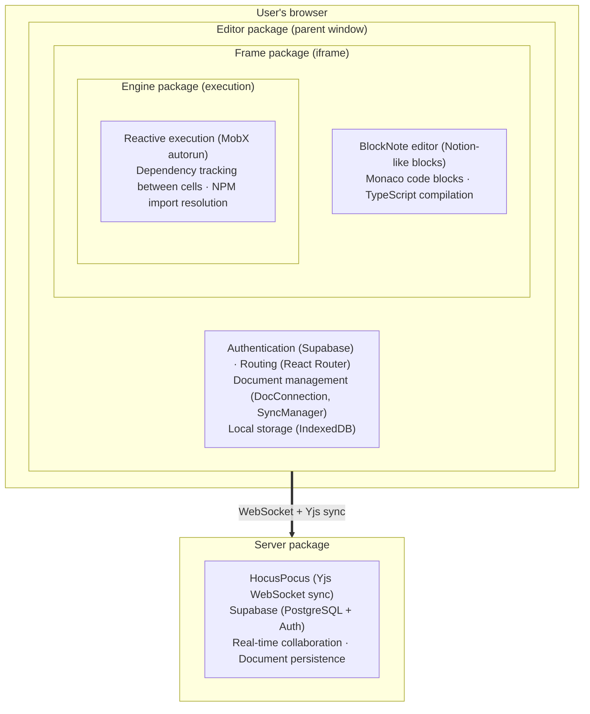

# TypeCell Developer Documentation (archived)

> **Archived.** These are the original TypeCell onboarding guides, kept for historical/rebuild
> reference now that the project has moved to a **greenfield** rebuild (see
> [`.docs/README.md`](../../README.md)). The running TypeCell implementation itself still lives on
> the `staging` branch — this archive is documentation only.

This directory contains onboarding guides for developers working on the TypeCell codebase (forked here as **Telestrator**). Each guide explains the architecture, key components, and data flow for a package — and ends with a **Rebuild Notes** section aimed at the in-progress ground-up refactor.

All diagrams are written in [Mermaid](https://mermaid.js.org/) so they render directly on GitHub and stay diff-able in version control.

## Where to start

- **Building a greenfield project inspired by this one?** Read **[greenfield-build-guide.md](../../greenfield-build-guide.md)** — a first-principles, feature-ordered build path (with **[stack-decisions.md](../../stack-decisions.md)** covering alternative stack choices, notably replacing the bespoke iframe/Monaco/CDN execution stack with **Sandpack**). This is an *alternative* to the dependency-ordered rebuild below, for projects starting fresh rather than refactoring in place.
- **Rebuilding this codebase 1-for-1?** Read **[development-history.md](./development-history.md)** first — it explains how the codebase was built (git-grounded) and gives a recommended, dependency-ordered rebuild sequence.
- **Learning the running system?** Follow the reading order below.

## Package Guides

| Package | Description | Guide |
|---------|-------------|-------|
| **util** | Foundation helpers: IDs, encoding, errors, React resource hooks | [util-onboarding-guide.md](./util-onboarding-guide.md) |
| **shared** | The type contract: frame-interop bridge, code models, refs, Supabase schema | [shared-onboarding-guide.md](./shared-onboarding-guide.md) |
| **y-penpal** | Yjs provider that syncs documents over Penpal/PostMessage across the iframe | [y-penpal-onboarding-guide.md](./y-penpal-onboarding-guide.md) |
| **engine** | Reactive code execution engine with MobX-based dependency tracking | [engine-onboarding-guide.md](./engine-onboarding-guide.md) |
| **parsers** | Notebook ⟷ Markdown conversion and the cell/document model | [parsers-onboarding-guide.md](./parsers-onboarding-guide.md) |
| **frame** | Sandboxed iframe runtime with Monaco editor and BlockNote | [frame-onboarding-guide.md](./frame-onboarding-guide.md) |
| **server** | HocusPocus collaboration server with Supabase persistence | [server-onboarding-guide.md](./server-onboarding-guide.md) |
| **editor** | Main application shell with auth, routing, and document management | [editor-onboarding-guide.md](./editor-onboarding-guide.md) |
| **packager** | Static export/bundling path: notebook → standalone buildable project | [packager-onboarding-guide.md](./packager-onboarding-guide.md) |
| **shared-test** | Test fixtures and client factories (Supabase + HocusPocus) | [shared-test-onboarding-guide.md](./shared-test-onboarding-guide.md) |

## Reading Order

For a complete understanding of the system, read in this order — foundations first, application shell last (this mirrors the rebuild sequence):

1. **[util](./util-onboarding-guide.md)** & **[shared](./shared-onboarding-guide.md)** — the foundation: helpers and the type contracts every other package speaks.
2. **[engine](./engine-onboarding-guide.md)** — the core reactive execution model that makes code cells re-run when dependencies change.
3. **[y-penpal](./y-penpal-onboarding-guide.md)** & **[frame](./frame-onboarding-guide.md)** — how the engine runs inside a sandboxed iframe, synced to the host, integrated with Monaco and BlockNote.
4. **[editor](./editor-onboarding-guide.md)** — how the main application hosts the iframe, handles authentication, and manages document persistence.
5. **[server](./server-onboarding-guide.md)** — the backend that enables real-time collaboration and stores documents.
6. **[parsers](./parsers-onboarding-guide.md)**, **[packager](./packager-onboarding-guide.md)**, **[shared-test](./shared-test-onboarding-guide.md)** — supporting packages, read as needed.

For the historical and rebuild context: **[development-history.md](./development-history.md)**.

## Architecture Overview

## Key Concepts

### Local-First Architecture
Documents are stored locally in IndexedDB and sync with the server when online. Users can work offline, and changes merge automatically using Yjs CRDTs.

### Reactive Execution
Code cells run inside MobX's `autorun()`. When a cell reads from the shared context (`$`), MobX tracks the dependency. When that value changes, the cell automatically re-runs.

### Sandboxed Execution
User code runs in an iframe for security isolation. The parent window (editor) and iframe (frame) communicate via Penpal, with Yjs updates tunneled through y-penpal.

### Row Level Security
Database access control is enforced in PostgreSQL using RLS policies. The server trusts the database to determine who can read/write each document.
