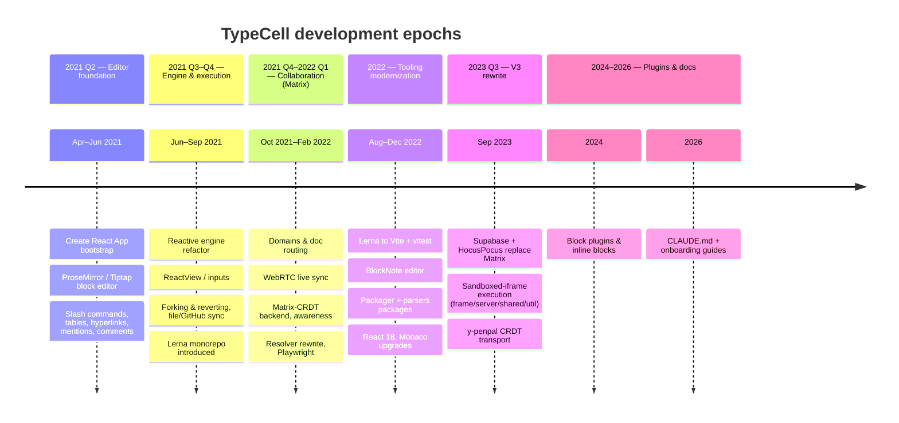
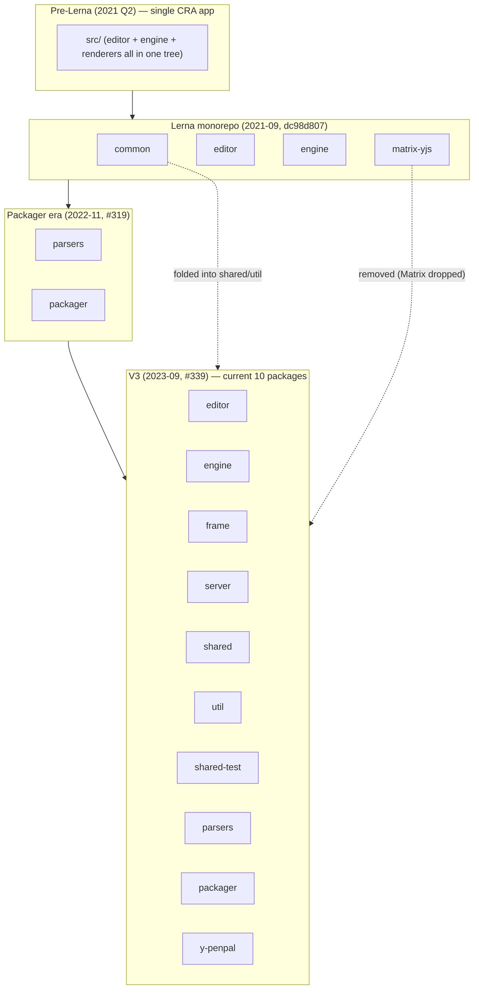
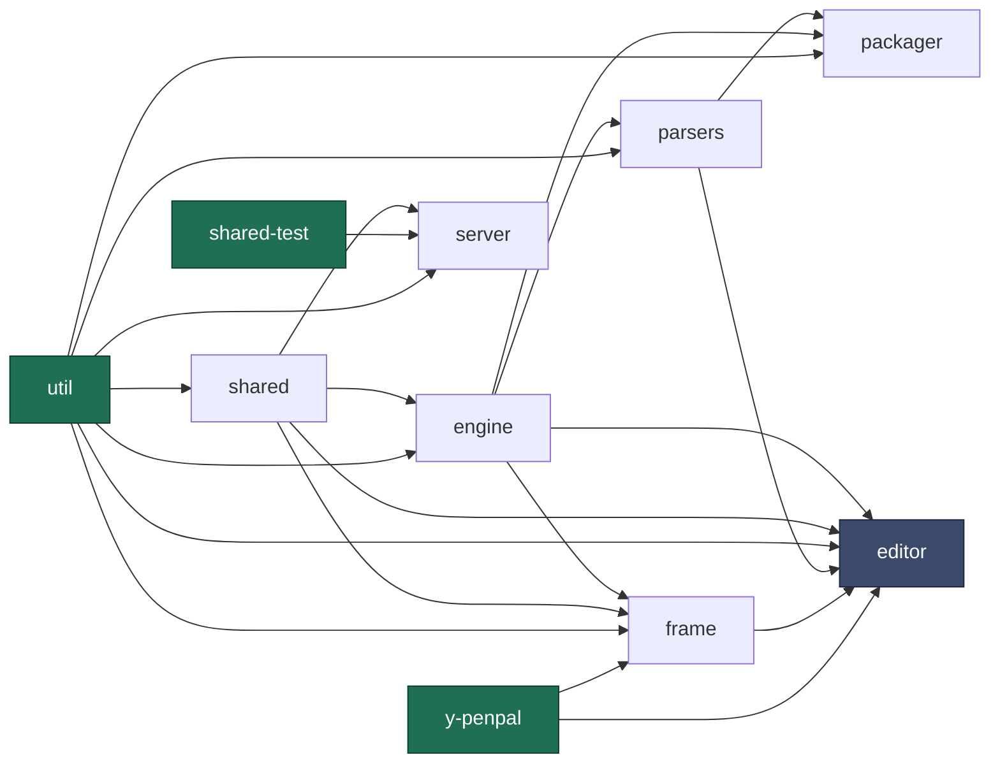
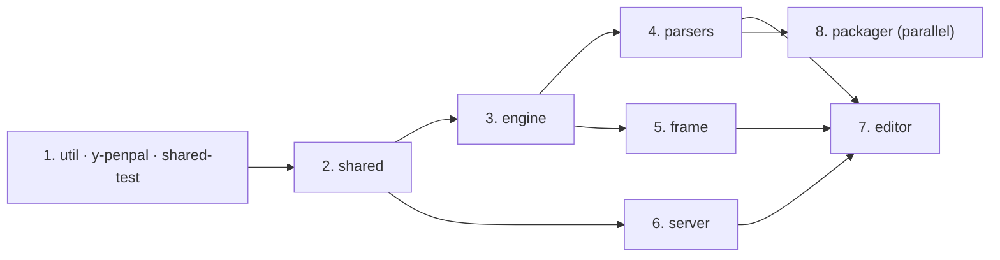

# Development History & Rebuild Sequence

> **Purpose.** This document does two things:
>
> 1. **Part 1 — How TypeCell was built.** A git-grounded, epoch-by-epoch narrative of how the codebase grew, so the rebuild team understands *why* the architecture looks the way it does and which decisions were deliberate versus incidental.
> 2. **Part 2 — Recommended rebuild sequence.** A dependency-ordered plan for rebuilding the project from the ground up, derived from the real package dependency graph.
>
> Every historical claim below cites a real commit (short hash) or pull request (`#NNN`). Where the record is ambiguous, that is called out explicitly rather than guessed.

This repository (**Telestrator**) is a fork of [TypeCell](https://github.com/TypeCellOS/TypeCell) (`YousefED` / `TypeCellOS`). The history described here is TypeCell's upstream history as preserved in this repo's git log: **683 commits spanning 2021-04-06 → 2026-02-08**.

---

## Part 1 — How TypeCell Was Built

### Timeline at a glance

### Epoch 1 — Rich-text block editor foundation (2021 Q2)

TypeCell began life as a **Notion-style block editor**, not a code runtime. The first commit bootstraps a Create React App project (`d009633a`, 2021-04-06). The bulk of spring 2021 went into the editing experience on top of ProseMirror/Tiptap:

- Slash commands, drag-and-drop blocks, tables, placeholders/trailing nodes.
- Hyperlink integration (`#113`), mentions (`#66`), and a **comments system** (`#128`).
- **Multi-block selection, deletion, and dragging** (`#114`).

This is the layer that would eventually be replaced by **BlockNote** (Epoch 4). The "notebook" vocabulary and block model originate here.

> **Rebuild takeaway:** the editor's block model has deep roots. By V3 it had been re-platformed onto BlockNote, so treat the *current* `frame`/`editor` block code as the source of truth — not the early ProseMirror code.

### Epoch 2 — Reactive engine & execution (2021 Q3–Q4)

The defining feature — *live, reactive code execution* — landed mid-2021:

- **engine-refactor** (`1f983f98`, merge of `#146`) established the reactive execution model that survives today.
- **ReactView / inputs** (`#192`, `225c5ce8`) added the ability for cells to render reactive React UI.
- **Forking & reverting** (`#186`, `f2320b24`) and **notebook matrix refactor + GitHub/file sync** (`#187`, `d257b0fb`) introduced document forking and external sync.
- The **Lerna monorepo** was introduced (`dc98d807`, "lerna", 2021-09-18). At this point the package set was: `common`, `editor`, `engine`, `matrix-yjs` — four packages, two of which (`editor`, `engine`) are still core today.

> **Rebuild takeaway:** the engine's MobX-`autorun` reactive model is the oldest *load-bearing* idea in the codebase and changed the least across rewrites. It is a good candidate to port largely intact. See [engine-onboarding-guide.md](./engine-onboarding-guide.md).

### Epoch 3 — Collaboration on a Matrix backend (2021 Q4 – 2022 Q1)

With editing and execution working, the focus shifted to **multiplayer and persistence**, originally built on the Matrix protocol:

- **Domains** (`#199`) and **load-docs routing** (`#200`).
- **WebRTC live sync** (`#214`, `ca496089`) for peer-to-peer updates.
- A Matrix-CRDT backend: **refactor matrix-yjs** (`#258`), **MatrixCRDTEventTranslator** (`#259`), then **remove matrix-crdt** (`#261`) as the abstraction was reworked.
- **Awareness / colored selections** (`#254`, `#255`) — presence indicators for collaborators.
- **Resolver rewrite** (`#286`, `3b6b72ab`) reworked NPM import resolution.
- **Playwright** test harness (`#291`, `a494bd52`).

> **Rebuild takeaway:** the entire Matrix layer was **removed** in V3. Do not rebuild it. It is historically important only because it explains why the collaboration abstractions (Yjs documents, awareness) exist independent of any specific transport — which is exactly what made the later swap to HocusPocus possible.

### Epoch 4 — Tooling modernization (2022)

A year of platform upgrades that reshaped the build and editor stack:

- **Lerna → Vite + vitest** (`#313`, `82ceb402`) — the modern dev/test toolchain.
- **BlockNote** (`#317`, `47006b16`) — the block editor was extracted/re-platformed onto BlockNote, replacing the bespoke ProseMirror layer from Epoch 1.
- **Packager** (`#319`, `a294d2fc`, 2022-11-17) — introduced the `parsers` and `packager` packages (notebook ⟷ markdown conversion and a static export/bundling path).
- **React 18** (`#323`, `7b80ce09`) and **Monaco upgrades** (`#325`, `#330`).

> **Rebuild takeaway:** Vite, vitest, BlockNote, Monaco, and React 18 are the *current* baseline. The `parsers` and `packager` packages predate V3 but were carried forward.

### Epoch 5 — V3, the big rewrite (2023 Q3) ⭐

**This is the pivotal architectural break.** The V3 PR (`#339`, `301e6057`, 2023-09-26) replaced the entire backend and execution-isolation model in one merge:

- **Supabase (PostgreSQL + Auth) + HocusPocus replace Matrix** for persistence and real-time sync. RLS policies move access control into the database.
- **Sandboxed-iframe execution** — user code is moved out of the main window into an isolated iframe. This introduced the `frame` (iframe runtime) and `server` (HocusPocus + Supabase) packages, plus the supporting `shared`, `util`, and `shared-test` packages.
- **y-penpal** (`#365`, `765abfa0`) — a custom Yjs provider that tunnels CRDT updates over Penpal/PostMessage between the parent window and the sandboxed iframe.

After V3 the package set reached its current **10-package** shape.

> **Rebuild takeaway:** V3 *is* the current architecture. When in doubt, the post-`#339` code is canonical. The package boundaries introduced here (host/editor ↔ iframe/frame, with `shared` as the type contract and `y-penpal` as the transport) are the load-bearing seams of the system and should be preserved in the rebuild. See [server-onboarding-guide.md](./server-onboarding-guide.md), [frame-onboarding-guide.md](./frame-onboarding-guide.md), and [y-penpal-onboarding-guide.md](./y-penpal-onboarding-guide.md).

### Epoch 6 — Plugins & inline blocks (2024)

**Block plugins and inline blocks** (`#376`, `a9bd7956`, 2024-05-22) extended the BlockNote editor with a plugin system and inline block types — the most recent substantive feature work in the upstream history.

### Epoch 7 — Documentation phase (2026)

The current epoch is documentation in preparation for this rebuild: `CLAUDE.md` (`b8e9bcd6`) followed by the original four onboarding guides (`467565cf`, `0577b80e`, `62c044e1`, `cbc49f2e`) and their index (`ff90f8ba`). This document and the expanded/diagrammed guides are the continuation of that work.

### How the package set grew

> **Note.** `matrix-yjs` and `common` from the Lerna era do not exist post-V3: the Matrix transport was removed, and `common` was effectively superseded by `shared` + `util`. `parsers` and `packager` were introduced before V3 and carried through.

---

## Part 2 — Recommended Rebuild Sequence

The rebuild should follow the **real internal dependency graph**, building foundations first and the application shell last. The edges below are taken directly from each package's `package.json` (`@typecell-org/*` dependencies), not inferred.

### Internal dependency graph (ground truth)

| Package | Internal dependencies |
|---|---|
| `util` | *(none)* |
| `y-penpal` | *(none)* |
| `shared-test` | *(none)* |
| `shared` | `util` |
| `engine` | `shared` |
| `parsers` | `util`, `engine` |
| `packager` | `util`, `engine`, `parsers` |
| `frame` | `util`, `shared`, `engine`, `y-penpal` |
| `server` | `shared`, `shared-test`, `util` |
| `editor` | `util`, `shared`, `engine`, `parsers`, `frame`, `y-penpal` |

### Build order

1. **Foundations (no internal deps) — build in parallel:**
   - **`util`** — generic helpers (uuid/nanoid, base64/binary, error utilities, React helpers). Everything depends on it. See [util-onboarding-guide.md](./util-onboarding-guide.md).
   - **`y-penpal`** — the Yjs-over-PostMessage transport primitive. Self-contained; depends only on Yjs protocol libs. See [y-penpal-onboarding-guide.md](./y-penpal-onboarding-guide.md).
   - **`shared-test`** — test fixtures/helpers (random users, Supabase + HocusPocus test clients). Only consumed by tests. See [shared-test-onboarding-guide.md](./shared-test-onboarding-guide.md).

2. **`shared`** (depends on `util`) — the **type contract**: code-model types, the host ↔ iframe bridge method signatures, the `Ref`/reference system, and the auto-generated Supabase `schema.ts`. Build this early; it is the interface both `editor`/`frame` and `server` agree on. See [shared-onboarding-guide.md](./shared-onboarding-guide.md).

3. **`engine`** (depends on `shared`) — the reactive execution core. The oldest stable idea in the codebase; port it carefully. See [engine-onboarding-guide.md](./engine-onboarding-guide.md).

4. **`parsers`** (depends on `engine`, `util`) — notebook ⟷ markdown conversion. See [parsers-onboarding-guide.md](./parsers-onboarding-guide.md).

5. **`frame`** (depends on `engine`, `shared`, `util`, `y-penpal`) — the sandboxed iframe runtime: BlockNote + Monaco + the engine, talking to the host over y-penpal. See [frame-onboarding-guide.md](./frame-onboarding-guide.md).

6. **`server`** (depends on `shared`, `shared-test`, `util`) — HocusPocus WebSocket sync + Supabase persistence + RLS. Can be built in parallel with `frame` once `shared` exists. See [server-onboarding-guide.md](./server-onboarding-guide.md).

7. **`editor`** (depends on everything) — the application shell: auth, routing, document management, and hosting the iframe. Build it last. See [editor-onboarding-guide.md](./editor-onboarding-guide.md).

8. **`packager`** (depends on `parsers`, `engine`, `util`) — the static export/bundling path. Independent of the editor UI; sequence it whenever the export feature is needed (it can trail the main app). See [packager-onboarding-guide.md](./packager-onboarding-guide.md).

### Critical-path summary

> **Rebuild guidance.** Each package's onboarding guide ends with a **"Rebuild notes"** section calling out coupling and pain points specific to that package. Read those alongside this sequence. The two hardest seams to get right — and the ones most worth preserving from V3 — are the **host ↔ iframe bridge** (typed in `shared`, transported by `y-penpal`) and the **engine's reactive `$` context**.
