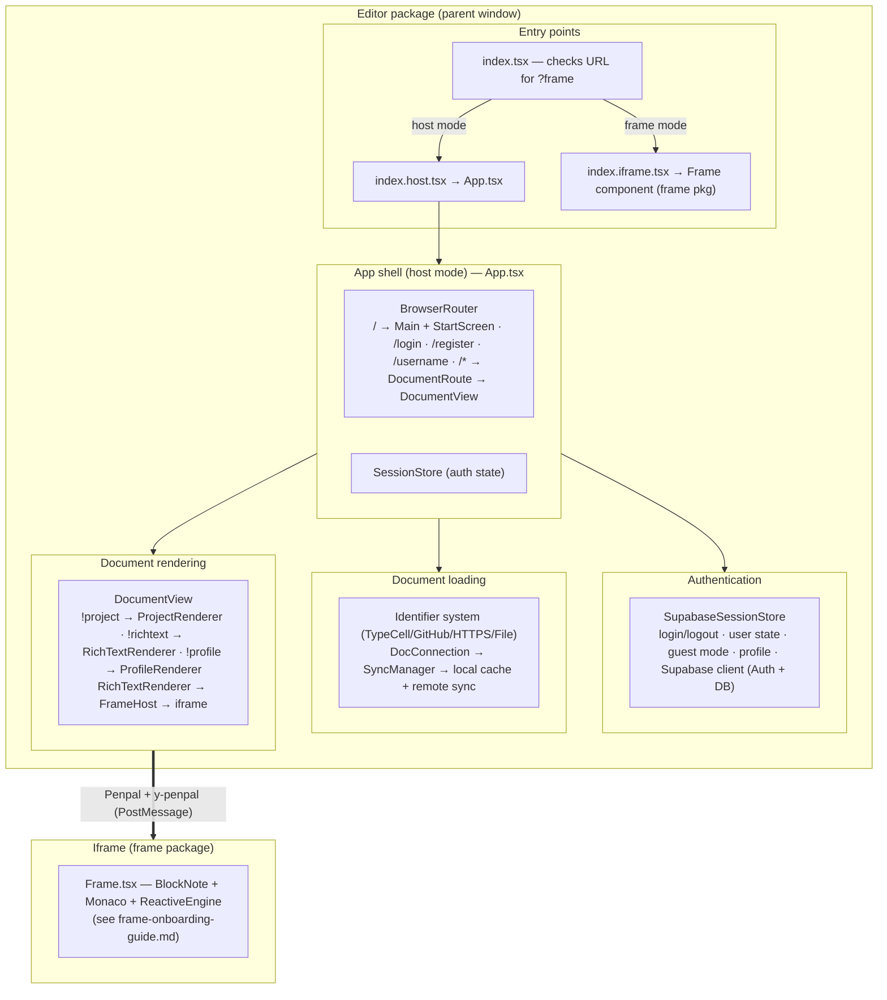
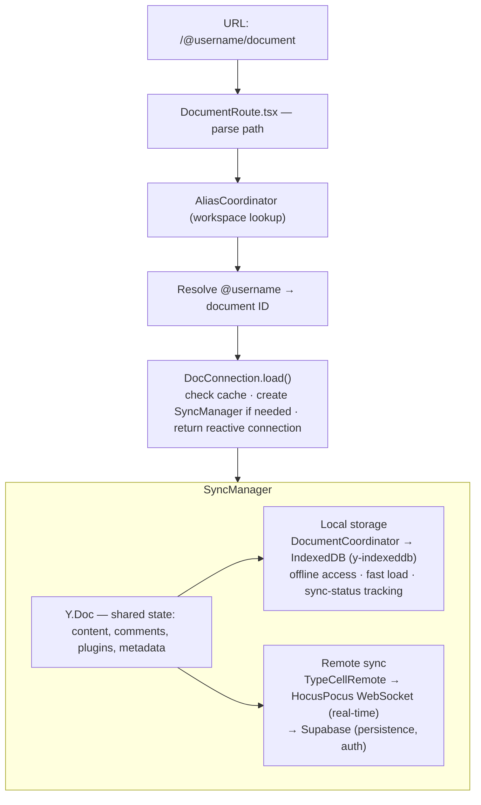
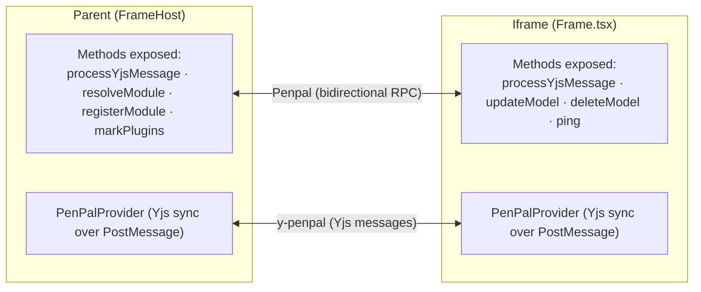
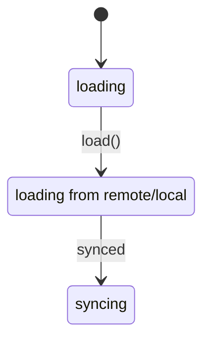
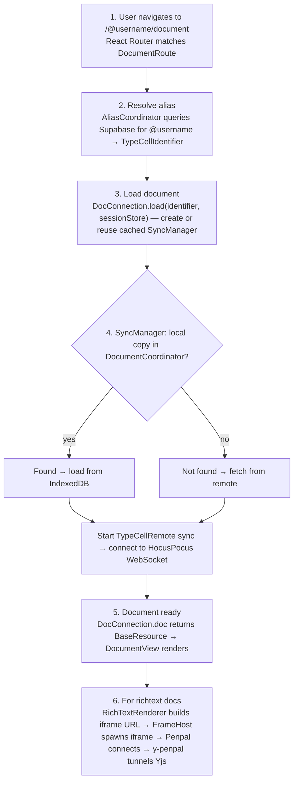
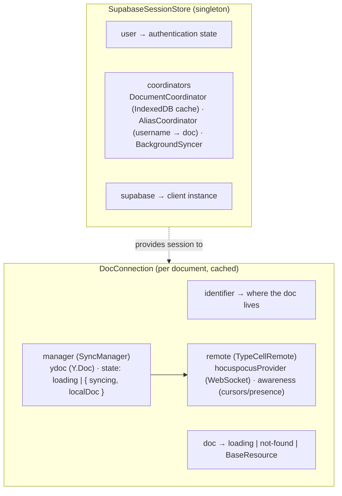
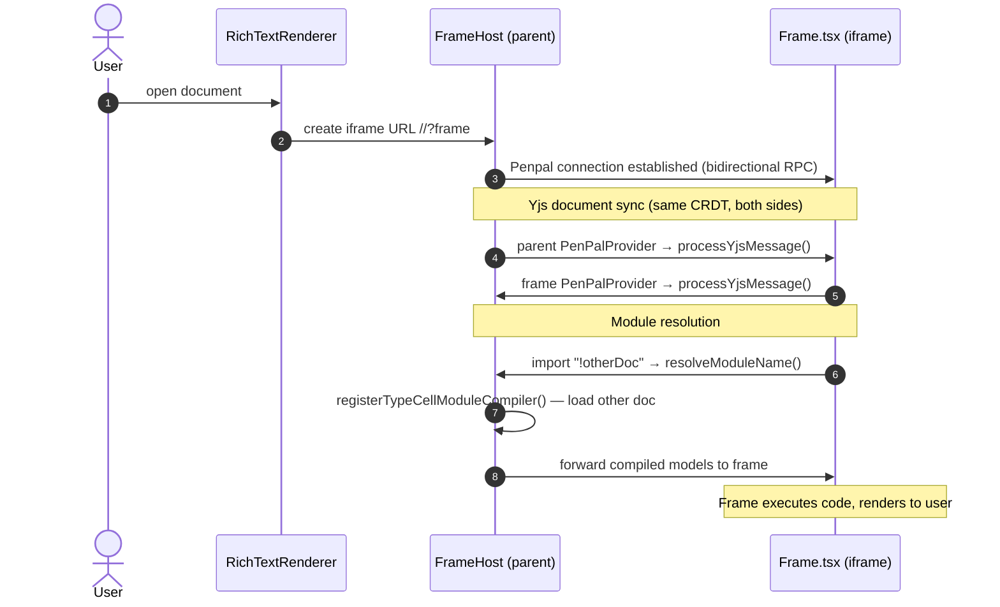

# Editor Package Onboarding Guide

## Section 1: Executive Summary

The `editor` package is the **main application shell** — it's what users see when they visit TypeCell. It handles everything outside the document editor itself: authentication, routing, document management, and persistence.

**Think of it like a smart filing cabinet with a lock.** The editor package manages who can access documents (authentication), where documents are stored (Supabase + IndexedDB), and how they're organized (workspaces, projects). The actual document editing happens in the `frame` package, which runs inside an iframe that the editor controls.

**Core Responsibilities:**
1. **Authentication** — Login/signup via Supabase (GitHub OAuth, email)
2. **Routing** — Parse URLs like `/@username/document` and load the right content
3. **Document management** — Create, load, fork, and sync documents
4. **Local-first storage** — Cache documents in IndexedDB for offline access
5. **Remote sync** — Sync with HocusPocus WebSocket server and Supabase
6. **Host the iframe** — Spawn and communicate with the `frame` package

**Key Technologies:**
- [React Router](https://reactrouter.com/) — Client-side routing
- [Supabase](https://supabase.com/) — Authentication and database
- [HocusPocus](https://hocuspocus.dev/) — Real-time WebSocket sync for Yjs
- [IndexedDB](https://developer.mozilla.org/en-US/docs/Web/API/IndexedDB_API) (via y-indexeddb) — Local document cache
- [MobX](https://mobx.js.org/) — State management
- [Penpal](https://github.com/Aaronius/penpal) — Parent ↔ iframe communication

**The Host/Frame Split:** The editor package runs as the "host" (parent window), while document editing happens in an iframe running the `frame` package. This separation provides security isolation — user code can't access authentication tokens or mess with the main application.

---

## Section 2: Architecture

### Document loading & sync architecture

### Parent ↔ iframe communication

---

## Section 3: Component Breakdown (Explain the "Why")

### 3.1 Entry Points: `index.tsx`, `index.host.tsx`, `index.iframe.tsx`

**What they do:** Route the application to either "host mode" (main app) or "frame mode" (iframe content) based on the URL.

**Why this split exists:** A single codebase serves two purposes:
1. **Host mode** — The main application shell with auth, routing, and document management
2. **Frame mode** — The sandboxed editor that runs inside an iframe

This is determined by checking if the URL contains `?frame`. The iframe URL is constructed by the host with this parameter.

**Analogy:** Like a restaurant that has both a dining room (host) and a kitchen (frame). Same building, but completely different operations happening in each area.

### 3.2 `SessionStore.ts` & `SupabaseSessionStore.ts` — The Gatekeeper

**What it does:** Manages user authentication state — login, logout, guest mode, user profile.

**Why it exists:** Almost everything in the app depends on knowing who the user is:
- Which documents can they access?
- Where should new documents be stored?
- What username should appear in collaboration cursors?

**Analogy:** Like a hotel front desk. It knows who checked in, gives out room keys (auth tokens), and tracks guest vs. registered guest status.

**Key Concepts:**
- **User states:** `"loading"` → `"guest-user"` or `{ type: "user", userId, ... }`
- **Coordinators:** `DocumentCoordinator` (local cache), `AliasCoordinator` (username → ID mapping)
- **Profile:** User's profile document with avatar, workspaces, etc.

### 3.3 `DocConnection.ts` — The Document Gateway

**What it does:** The primary interface for loading documents. Handles caching, reference counting, and exposes the document state reactively via MobX.

**Why it exists:** Documents are expensive to load (IndexedDB, network sync). We need a caching layer that:
- Reuses existing connections when the same document is requested twice
- Properly disposes resources when no longer needed (reference counting)
- Provides a consistent reactive interface (`doc`, `tryDoc`, `needsFork`)

**Analogy:** Like a library checkout system. Instead of buying a new copy of every book, you check out from the library. When you're done, you return it. The library tracks who has what.

**Key Methods:**
- `DocConnection.load(identifier, sessionStore)` — Load (or get cached) document
- `DocConnection.create(sessionStore)` — Create a new document
- `connection.fork()` — Create a copy you can edit
- `connection.waitForDoc()` — Async wait until document is loaded

### 3.4 `SyncManager.ts` — The Sync Orchestrator

**What it does:** Manages the synchronization lifecycle for a single document — loading from cache, syncing with remote, tracking sync status.

**Why it exists:** Syncing is complex. A document might:
- Exist locally but not remotely (offline creation)
- Exist remotely but not locally (first load)
- Have unsynced changes (offline edits)
- Need to track whether sync is up-to-date

**Analogy:** Like a sync service (Dropbox). It keeps your local folder in sync with the cloud, handles conflicts, and knows when you're offline.

**Key State Machine:**

### 3.5 `TypeCellRemote.ts` — The Cloud Connection

**What it does:** Handles the actual network sync with the TypeCell backend via HocusPocus WebSocket.

**Why it exists:** This is where the real-time magic happens. HocusPocus is a Yjs sync server that:
- Keeps multiple clients in sync
- Persists documents to Supabase
- Handles authentication and authorization
- Provides awareness (cursor positions, presence)

**Analogy:** Like a conference call service. Multiple people can join the same "room" (document), see each other's changes in real-time, and the service records everything.

**Key Features:**
- `startSyncing()` — Connect to WebSocket and begin sync
- `create()` — Create document in Supabase
- `awareness` — Cursor positions and presence data
- `unsyncedChanges` — Number of local changes not yet synced

### 3.6 `DocumentCoordinator.ts` — The Local Cache Manager

**What it does:** Manages the IndexedDB cache of documents. Tracks which documents exist locally, their sync status, and handles the local-first storage layer.

**Why it exists:** Local-first means the app works offline. Documents are stored in IndexedDB and sync with the server when online. The coordinator tracks:
- Which documents exist locally
- Whether they've been synced to the server
- Whether they need to be created remotely

**Analogy:** Like a local library branch. Books (documents) are stored locally, but periodically a truck (sync) exchanges books with the central library.

### 3.7 `DocumentView.tsx` — The Content Router

**What it does:** Given a loaded document, renders the appropriate UI based on the document type.

**Why it exists:** TypeCell has multiple document types (`!richtext`, `!project`, `!profile`, `!notebook`). Each needs a different renderer. DocumentView is the switch that routes to the right one.

**Type → Renderer Mapping:**
- `!richtext` → `RichTextRenderer` → `FrameHost` → iframe
- `!project` → `ProjectRenderer` (workspace/folder view)
- `!profile` → `ProfileRenderer` (user profile page)
- `!notebook` → Not yet implemented

### 3.8 `FrameHost.tsx` — The Iframe Manager

**What it does:** Creates the iframe that hosts the `frame` package, sets up Penpal connection, and bridges Yjs sync via y-penpal.

**Why it exists:** The actual document editing happens in an iframe for security isolation. FrameHost:
- Creates the iframe with proper sandbox permissions
- Establishes Penpal connection for RPC
- Sets up y-penpal to tunnel Yjs updates through PostMessage
- Handles module resolution for TypeCell notebook imports

**Analogy:** Like an embassy. It's a secure space (iframe) within your country (parent window) where foreign diplomats (user code) can operate under controlled conditions.

**Key Exposed Methods (to iframe):**
- `processYjsMessage()` — Tunnel Yjs updates
- `resolveModuleName()` — Resolve `!docId` to full identifier
- `registerTypeCellModuleCompiler()` — Load another notebook as a module
- `markPlugins()` — Track which documents expose plugins

### 3.9 Identifier System (`identifiers/`) — The Address Book

**What it does:** Parses and represents different document address formats.

**Why it exists:** TypeCell can load documents from multiple sources:
- `typecell://typecell.org/docId` — TypeCell hosted documents
- `https://example.com/doc.md` — Remote markdown files
- `github://owner/repo/path` — GitHub files
- `file:///path/to/file` — Local files (dev mode)

**Key Classes:**
- `TypeCellIdentifier` — Native TypeCell documents
- `HttpsIdentifier` — Remote HTTP resources
- `GithubIdentifier` — GitHub-hosted files
- `FileIdentifier` — Local filesystem

---

## Section 4: Key Relationships and Data Flow

### The Document Loading Lifecycle

### State Management Hierarchy

### Parent ↔ Iframe Data Flow

---

## Public API / Boundaries

- **Internal dependencies:** `util`, `shared`, `engine`, `parsers`, `frame`, `y-penpal` — it depends on **everything**, which is why it is built **last** (see [development-history.md](./development-history.md#part-2--recommended-rebuild-sequence)).
- **Depended on by:** nothing (it is the application root / deployable).
- **Cross-boundary role:** acts as the **host** — implements `HostBridgeMethods` from [`shared`](./shared-onboarding-guide.md), spawns the iframe ([`frame`](./frame-onboarding-guide.md)), owns the HocusPocus + Supabase connection, and tunnels Yjs via [`y-penpal`](./y-penpal-onboarding-guide.md).

---

## Rebuild Notes

- **Build this last.** It assembles every other package; stabilize the foundations, engine, frame, and server first.
- **The host/frame split is sacred.** Auth tokens, Supabase, and HocusPocus must live *only* in the host; the iframe gets data exclusively through the typed bridge. This isolation is the core security property introduced by V3 (`#339`).
- **Local-first is non-trivial.** The `DocConnection` → `SyncManager` → `DocumentCoordinator`/`TypeCellRemote` layering (cache + ref-counting + offline) is the riskiest area to rebuild — treat IndexedDB caching and HocusPocus sync as separable, individually-testable concerns.
- The **identifier system** (`TypeCell`/`GitHub`/`HTTPS`/`File`) is a clean extension point; preserve its shape.

---

## Quick Reference: File → Responsibility

| File | One-Line Summary |
|------|------------------|
| `index.tsx` | Entry point: routes to host or frame mode |
| `index.host.tsx` | Host mode bootstrap: auth, React root |
| `index.iframe.tsx` | Frame mode bootstrap: renders Frame component |
| `App.tsx` | React Router setup, top-level routes |
| `Main.tsx` | Main layout with navigation bar |
| `SessionStore.ts` | Abstract auth state management |
| `SupabaseSessionStore.ts` | Supabase-specific auth implementation |
| `DocConnection.ts` | Document loading with caching and ref-counting |
| `SyncManager.ts` | Orchestrates local cache and remote sync |
| `DocumentCoordinator.ts` | Manages IndexedDB document cache |
| `TypeCellRemote.ts` | HocusPocus WebSocket sync |
| `DocumentView.tsx` | Routes document type to renderer |
| `RichTextRenderer.tsx` | Creates iframe URL for richtext docs |
| `FrameHost.tsx` | Manages iframe lifecycle and Penpal bridge |
| `identifiers/*.ts` | Parse/represent document addresses |
| `routes/*.tsx` | Route components and URL parsing |

---

## Getting Started: Where to Look First

1. **Start with `index.tsx` and `index.host.tsx`** — Understand the host/frame split and how the app bootstraps.

2. **Read `SupabaseSessionStore.ts`** — Understand authentication flow and how user state is managed.

3. **Trace a document load through `DocConnection.ts` → `SyncManager.ts`** — See how documents go from URL to rendered content.

4. **Study `FrameHost.tsx`** — Understand how the parent window creates and communicates with the iframe.

5. **Explore `identifiers/`** — Understand how different document sources (TypeCell, GitHub, HTTPS) are represented.

The routing in `App.tsx` and `routes/document.tsx` ties everything together — follow a URL through the router to see how it reaches `DocumentView`.
