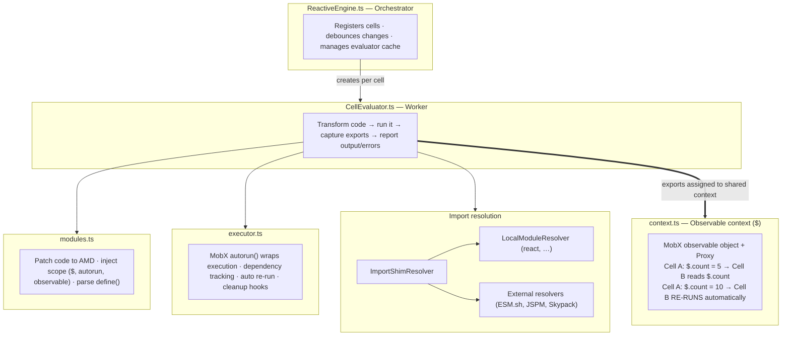
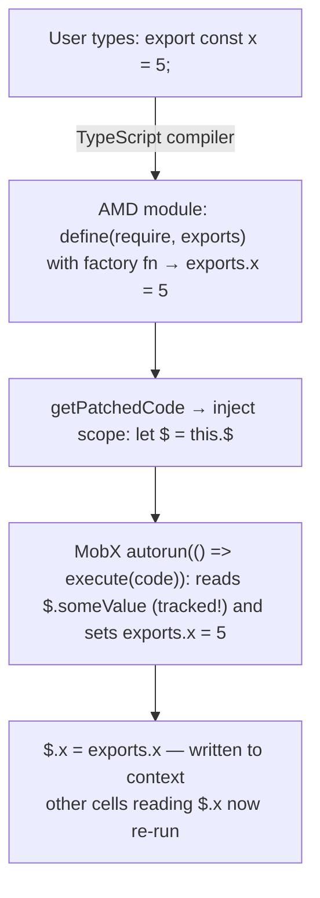
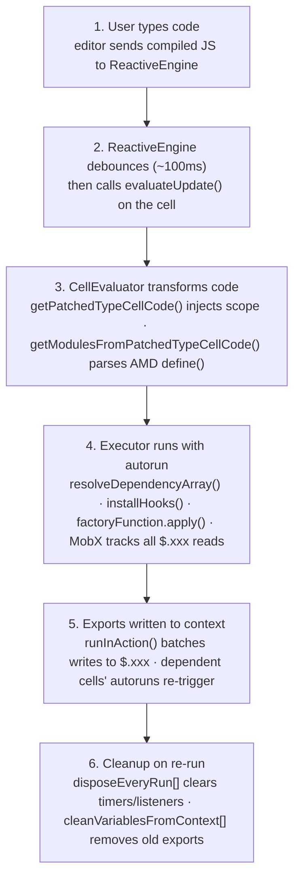
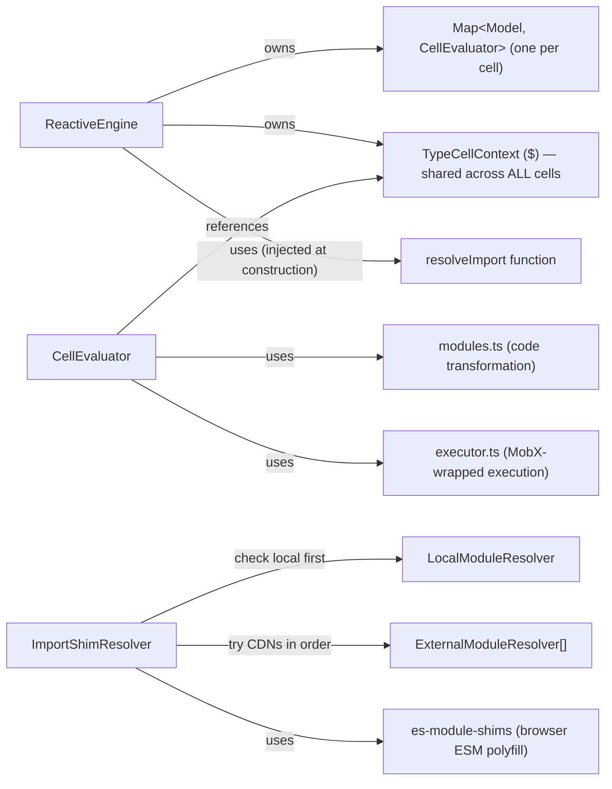
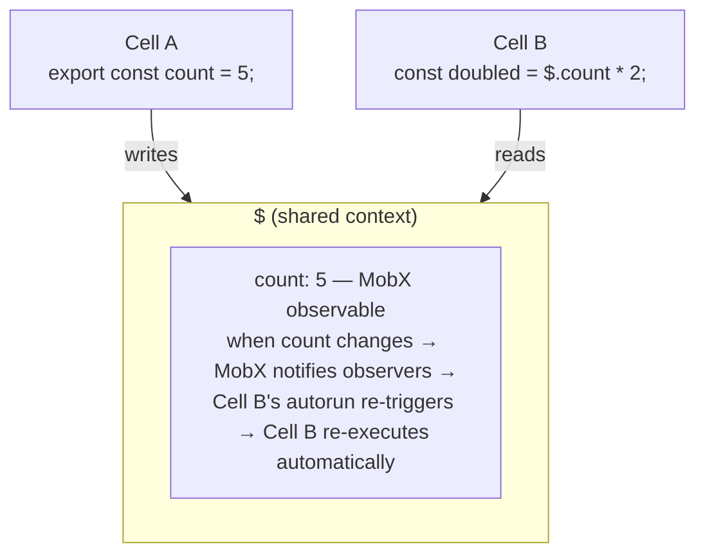

# Engine Package Onboarding Guide

## Section 1: Executive Summary

The `engine` package is the **brain** of TypeCell's live coding experience. Its job is deceptively simple: when you type code in a cell, execute it immediately; when something that code depends on changes, re-execute it automatically.

**Think of it like a smart spreadsheet.** In Excel, if cell B1 contains `=A1*2`, changing A1 automatically updates B1. The engine does exactly this, but for JavaScript/TypeScript code instead of formulas.

**Core Responsibilities:**
1. **Execute code cells** as the user types
2. **Track dependencies** between cells (Cell B uses a variable from Cell A)
3. **Re-execute cells** when their dependencies change
4. **Resolve imports** (let users `import lodash from "lodash"` and fetch it from a CDN)
5. **Clean up side effects** (timers, event listeners) when code re-runs

**Key Technology:** The magic happens through [MobX](https://mobx.js.org/), a reactive state library. MobX can automatically track which data a function reads, then notify us when that data changes.

---

## Section 2: Architecture

### Data flow: single-cell execution

---

## Section 3: Component Breakdown (Explain the "Why")

### 3.1 `ReactiveEngine.ts` — The Orchestrator

**What it does:** Manages the lifecycle of all code cells. Watches for changes, debounces rapid edits, and coordinates everything.

**Why it exists:** You need something to be the "boss" — to know about all cells, manage their state, and coordinate re-execution. Without this central manager, cells would have no way to know about each other.

**Analogy:** Think of the ReactiveEngine as a **classroom teacher**. The teacher doesn't do the homework (execute code), but they assign work to students (CellEvaluators), collect the results, and make sure everyone stays in sync.

**Key Design Decisions:**
- **Debouncing (100ms default):** Users type fast. If we ran code on every keystroke, we'd waste CPU and show flickering errors for incomplete code. The debounce waits for a pause in typing.
- **Evaluator Cache:** Creating a new evaluator is expensive. We reuse them per cell.
- **Event System:** Uses VS Code's event library for `onOutput` and `onBeforeExecution` events so external code can react to cell execution.

### 3.2 `CellEvaluator.ts` — The Worker

**What it does:** Takes compiled JavaScript, transforms it, runs it, and captures what it exports.

**Why it exists:** Separates the "how to run one cell" logic from "how to manage many cells." This makes testing easier and keeps responsibilities clear.

**Analogy:** If ReactiveEngine is the teacher, CellEvaluator is the **grading assistant** — given one assignment, it knows exactly how to process it and report the result.

**Key Design Decisions:**
- **Disposes previous execution:** When code changes, we need to clean up the old run (stop timers, remove listeners) before starting fresh.
- **Assigns exports to context:** After execution, exported variables are placed on the shared `$` context so other cells can access them.

### 3.3 `context.ts` — The Shared Blackboard

**What it does:** Creates the `$` object that all cells share. This is how cells communicate.

**Why it exists:** Cells need a way to share data. Rather than explicitly wiring Cell A's output to Cell B's input (like traditional data pipelines), we use a shared reactive object. Any cell can write to `$`, any cell can read from `$`, and MobX handles the rest.

**Analogy:** Imagine a **classroom whiteboard**. Any student can write on it, any student can read from it. When someone erases and rewrites a section, everyone looking at that section notices immediately.

**Key Design Decisions:**
- **Proxy wrapper:** The context uses JavaScript Proxy to intercept reads/writes. This lets us handle special cases like React views.
- **Three flavors:** `rawContext` (direct MobX observable), `context` (proxy with view handling), `viewContext` (for internal view tracking). You'll mostly interact with `context`.

### 3.4 `executor.ts` — The Magic Happens Here

**What it does:** Wraps code execution in MobX's `autorun()`. This is what enables automatic dependency tracking and re-execution.

**Why it exists:** This is the core innovation. By running user code inside `autorun()`, MobX automatically tracks every observable value the code reads. When any of those values change, `autorun()` re-runs the code.

**Analogy:** Think of `autorun` as a **security camera with motion detection**. It watches everything the code "touches" (reads). If any of those things move (change), it triggers a re-recording (re-execution).

**Key Design Decisions:**
- **Loop detection:** If a cell reads and writes the same variable, it would infinitely re-run. The executor detects this and throws an error.
- **Cleanup arrays:** Tracks disposables (things to clean up) so re-runs don't leave zombie timers/listeners.
- **runInAction:** Batches all context writes so dependent cells only re-run once, not on each individual write.

### 3.5 `modules.ts` — The Code Transformer

**What it does:** Transforms compiled code into a format the executor can run. Injects the execution scope (`$`, `autorun`, `observable`, etc.).

**Why it exists:** TypeScript compiles to AMD module format (`define([], function(){...})`). We need to:
1. Parse this format to extract the factory function
2. Inject our special variables so user code can access `$`, `autorun`, etc.

**Analogy:** Like a **movie translator** who takes a foreign film and adds subtitles. The movie is the same, but now your audience (the executor) can understand it.

**Key Design Decisions:**
- **createExecutionScope:** Defines exactly what variables are available to user code. Currently: `$`, `$views`, `autorun`, `untracked`, `computed`, `observable`.
- **getPatchedTypeCellCode:** Prepends variable declarations so `let $ = this.$` is available.

### 3.6 `resolvers/` — The Package Fetchers

**What it does:** When user code imports a package (`import _ from "lodash"`), resolvers fetch it from a CDN.

**Why it exists:** TypeCell runs in the browser — there's no `node_modules`. We need to fetch packages on-demand from the internet.

**Analogy:** Like a **librarian** who, when you ask for a book they don't have, calls other libraries and gets you a copy.

**Key Components:**
- **ImportShimResolver:** Orchestrator for resolvers. Uses `es-module-shims` library to intercept browser imports.
- **LocalModuleResolver:** Provides bundled packages (like React) so we don't fetch duplicates.
- **ESMshResolver / JSPMResolver / SkypackResolver:** Different CDNs to try. If one fails, try the next.

### 3.7 `hookDisposables.ts` — The Cleanup Crew

**What it does:** Intercepts `setTimeout`, `setInterval`, and `addEventListener` during execution so they can be cleaned up on re-run.

**Why it exists:** If user code does `setInterval(() => console.log("hi"), 1000)`, and then they edit the code, we need to stop that interval. Otherwise, old intervals accumulate and cause chaos.

**Analogy:** Like a **stage crew** that tracks every prop placed during a scene. When the scene changes, they know exactly what to remove.

---

## Section 4: Key Relationships and Data Flow

### The Complete Execution Lifecycle

### Critical Data Dependencies

### The `$` Context: Heart of Reactivity

---

## Public API / Boundaries

- **Exports:** `ReactiveEngine` (the orchestrator), the `$` context types/helpers (`context.ts`), and the resolver interfaces.
- **Internal dependencies:** `shared` (for the `CodeModel` abstraction and types).
- **Depended on by:** `frame` (runs the engine in the iframe), `parsers`, `packager`, `editor`.
- **Injected at construction:** a `resolveImport` function — the engine does **not** know how modules are fetched; the host (`frame`) supplies that. This keeps the engine transport- and CDN-agnostic.

---

## Rebuild Notes

- **This is the oldest load-bearing idea in the codebase** (the reactive `autorun` model dates to the 2021 engine-refactor `#146`; see [development-history.md](./development-history.md#epoch-2--reactive-engine--execution-2021-q3q4)). It changed the least across rewrites — a strong candidate to **port largely intact** rather than redesign.
- The two subtle correctness points are **loop detection** (a cell that reads and writes the same `$` value) and **disposal ordering** (`disposeEveryRun` / `cleanVariablesFromContext`). Rebuild these with tests first.
- Keep `resolveImport` **injected**, not hardcoded — that decoupling is why the engine can run unchanged inside the sandboxed iframe.
- Keep `context.ts` independent of any editor (Monaco/BlockNote) — it should only depend on MobX + `shared`.

---

## Quick Reference: File → Responsibility

| File | One-Line Summary |
|------|------------------|
| `ReactiveEngine.ts` | Manages all cells, debounces changes, coordinates execution |
| `CellEvaluator.ts` | Runs one cell: transform → execute → capture output |
| `context.ts` | Creates the shared `$` object (MobX observable + Proxy) |
| `executor.ts` | Wraps execution in `autorun()` for dependency tracking |
| `modules.ts` | Parses AMD format, injects scope variables |
| `hookDisposables.ts` | Tracks timers/listeners for cleanup |
| `resolvers/*.ts` | Fetches NPM packages from CDNs |
| `view.ts` / `reactView.ts` | Special handling for reactive UI views |
| `mobx/customAnnotation.ts` | Prevents deep-observing React elements |

---

## Getting Started: Where to Look First

1. **Start with `context.ts`** — Understand the `$` object. It's simple and foundational.
2. **Read `executor.ts` next** — See how `autorun()` creates the reactive magic.
3. **Then `CellEvaluator.ts`** — See how code gets transformed and run.
4. **Finally `ReactiveEngine.ts`** — See how everything is orchestrated.

The resolvers are somewhat independent — explore them when you need to understand how imports work.
