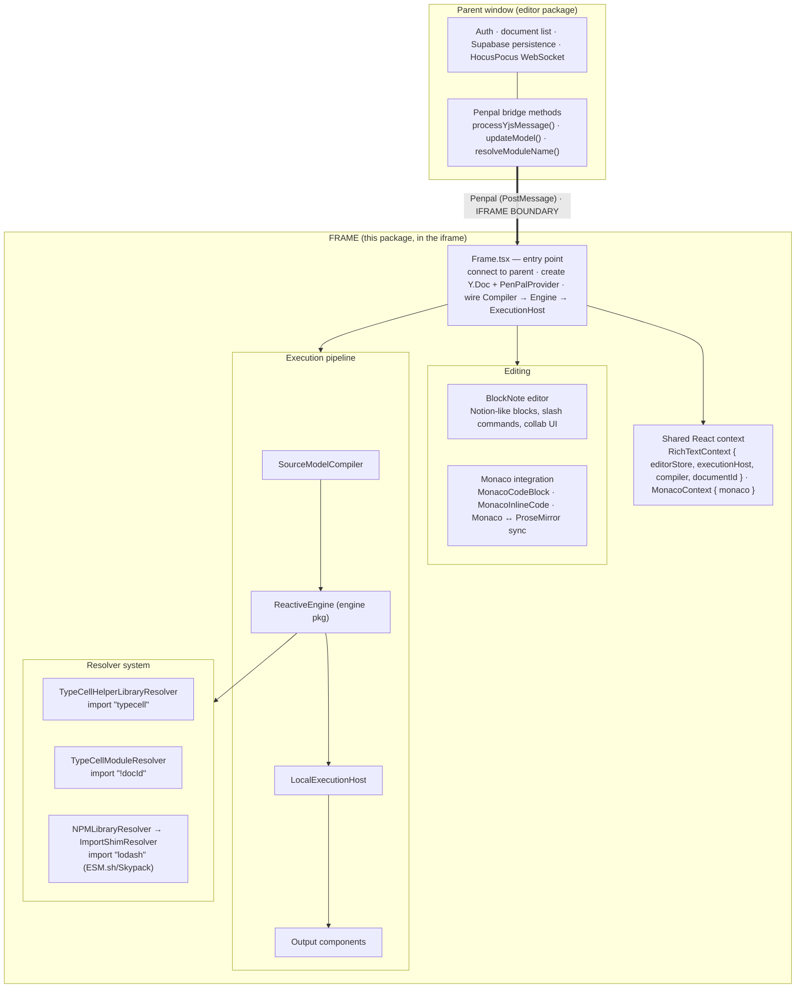
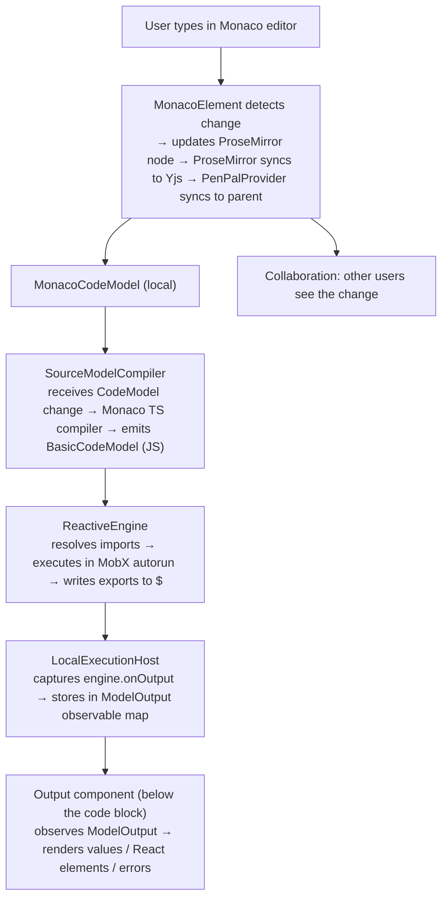
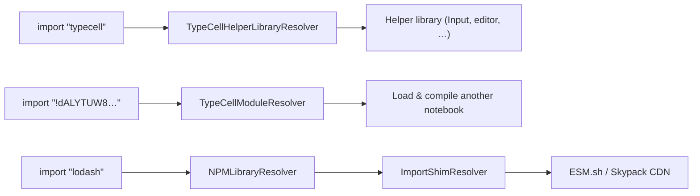
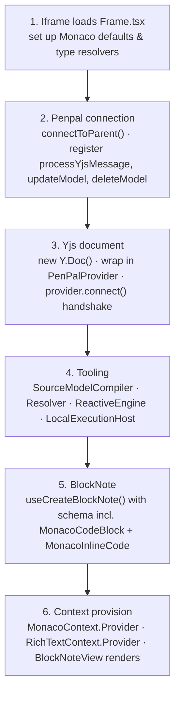
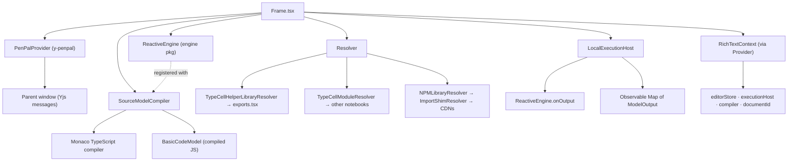
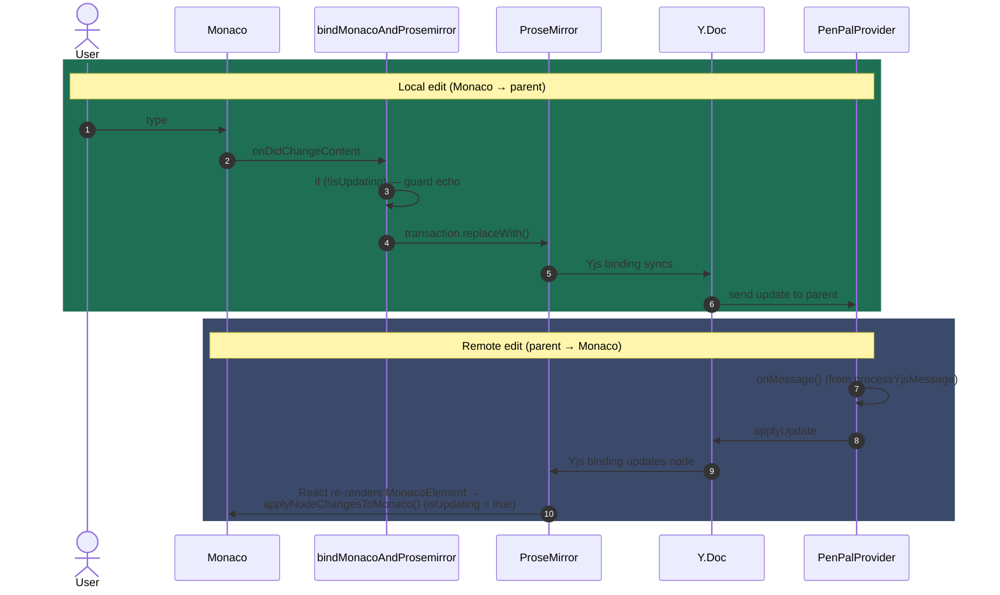

# Frame Package Onboarding Guide

## Section 1: Executive Summary

The `frame` package is the **sandboxed runtime environment** where user code actually executes. It runs inside an iframe, isolated from the main TypeCell application for security and stability.

**Think of it like a secure playground.** The main editor (parent window) is like a school — it manages documents, handles authentication, and persists data. The frame is like a fenced playground where kids (user code) can run freely without accidentally breaking the school building.

**Core Responsibilities:**
1. **Render the document editor** (BlockNote + Monaco code blocks)
2. **Compile TypeScript to JavaScript** in real-time
3. **Execute code cells** using the ReactiveEngine from the `engine` package
4. **Display outputs** below each code cell
5. **Sync document changes** with the parent window via Yjs over Penpal
6. **Resolve imports** (npm packages, other TypeCell notebooks, the `typecell` helper library)

**Key Technologies:**
- [BlockNote](https://www.blocknotejs.org/) — Notion-like block editor built on Tiptap/ProseMirror
- [Monaco Editor](https://microsoft.github.io/monaco-editor/) — VS Code's editor component
- [Penpal](https://github.com/Aaronius/penpal) — Secure parent ⟷ iframe communication
- [Yjs](https://docs.yjs.dev/) — CRDT for real-time collaboration

**Why an iframe?** User code can do anything — infinite loops, DOM manipulation, memory leaks. The iframe isolates this chaos so a buggy notebook can't crash the whole application. If it breaks, we just reload the iframe.

---

## Section 2: Architecture

### Data flow: from keystroke to output

---

## Section 3: Component Breakdown (Explain the "Why")

### 3.1 `Frame.tsx` — The Control Room

**What it does:** The main React component that bootstraps everything. It's the entry point for the iframe.

**Why it exists:** Something needs to wire together all the pieces — Penpal connection, Yjs sync, BlockNote editor, Monaco, compiler, engine, and output rendering. Frame.tsx is that orchestrator.

**Analogy:** If the frame package is a theater production, Frame.tsx is the **stage manager** — making sure the lights, sound, actors, and props all work together seamlessly.

**Key Setup Steps (in order):**
1. Connect to parent window via Penpal
2. Create Y.Doc and PenPalProvider for Yjs sync
3. Initialize Monaco with TypeScript support and type resolvers
4. Create SourceModelCompiler, Resolver, ReactiveEngine, and LocalExecutionHost
5. Create BlockNote editor with custom code block types
6. Provide everything through React context

### 3.2 `SourceModelCompiler.ts` — The Translator

**What it does:** Takes TypeScript source code and compiles it to JavaScript using Monaco's built-in TypeScript compiler.

**Why it exists:** The ReactiveEngine (from `engine` package) only understands JavaScript in AMD format. TypeScript needs to be compiled first. By using Monaco's compiler, we get the same compilation that powers VS Code's IntelliSense.

**Analogy:** Like a **simultaneous interpreter** at the UN — as the speaker talks (user types TypeScript), the interpreter immediately translates to another language (JavaScript) for the audience (ReactiveEngine).

**Key Design Decisions:**
- **Dual model system:** Maintains both a source CodeModel (TypeScript) and a compiled BasicCodeModel (JavaScript). When source changes, it recompiles.
- **Monaco integration:** Uses `getMonacoModel()` to share models with the editor, so both the visible editor and the compiler see the same code.

### 3.3 `LocalExecutionHost.tsx` — The Stage

**What it does:** Connects the compiler to the ReactiveEngine and captures outputs to display them.

**Why it exists:** The engine fires events when cells produce output, but something needs to catch those events and render them as React components. LocalExecutionHost bridges execution and rendering.

**Analogy:** Like a **TV studio control room** — it takes the raw camera feed (engine output) and puts it on the screen (renders Output components).

**Key Design Decisions:**
- **Observable outputs map:** Uses MobX `observable.map` so UI updates automatically when outputs change.
- **VisualizerExtension integration:** Supports custom visualizers that can render types in special ways.

### 3.4 `MonacoCodeBlock.tsx` & `MonacoInlineCode.tsx` — Custom Block Types

**What it does:** Defines the "codeblock" and "inlineCode" block types for BlockNote. These embed Monaco editors inside the document.

**Why it exists:** BlockNote is a generic block editor. TypeCell needs special code blocks that integrate with Monaco, show outputs, and participate in the reactive execution system.

**Analogy:** Like **custom LEGO pieces** — BlockNote provides standard blocks (paragraphs, headings), but we need special pieces that can run code.

**Key Design Decisions:**
- **Tiptap integration:** Uses Tiptap's NodeView system to embed React components (MonacoElement) inside ProseMirror.
- **Arrow key navigation:** Custom keymap handlers so arrow keys properly navigate into/out of code blocks.

### 3.5 `MonacoElement.tsx` — The Editor Component

**What it does:** The actual Monaco editor component that renders inside code blocks. Handles two-way sync between Monaco and ProseMirror.

**Why it exists:** Monaco and ProseMirror are both sophisticated editors with their own document models. They need to stay synchronized — changes in Monaco must reflect in ProseMirror (for Yjs collaboration), and vice versa.

**Analogy:** Like an **embassy translator** who must faithfully convey messages in both directions between two governments (Monaco and ProseMirror).

**Key Design Decisions:**
- **Bidirectional sync:** `applyNodeChangesToMonaco()` and `bindMonacoAndProsemirror()` handle the delicate sync dance.
- **Block vs Inline modes:** Same component handles both full code blocks and inline code snippets, with different layouts.
- **Collapsible code:** Blocks starting with `// @default-collapsed` start collapsed, showing only output.

### 3.6 `resolver/Resolver.ts` — The Import Detective

**What it does:** When user code has an import statement, the Resolver figures out where to get the module from.

**Why it exists:** Unlike Node.js with its `node_modules`, the browser has no built-in way to resolve `import "lodash"`. We need a system to handle different import types differently.

**Analogy:** Like a **concierge service** at a hotel. "Need React? We have it in-house. Need lodash? Let me order it from the CDN. Need another TypeCell notebook? Let me connect you."

**Import Resolution Chain:**

### 3.7 `lib/exports.tsx` — The Helper Library

**What it does:** Provides the `typecell` module that users import for helper functions like `typecell.Input`, `typecell.editor`, and `typecell.AutoForm`.

**Why it exists:** Users need tools to build interactive notebooks — form inputs, block registration, persistent storage. This module exposes those tools.

**Key APIs:**
- `typecell.Input` — Reactive form inputs
- `typecell.editor.registerBlock()` — Register custom slash commands
- `typecell.editor.currentBlock` — Access the current block's metadata
- `typecell.onDispose()` — Register cleanup functions
- `typecell.AutoForm` — Auto-generate settings forms

### 3.8 `EditorStore.ts` — The State Keeper

**What it does:** MobX store that holds editor-wide state like custom blocks, block settings, and provides block lookup functionality.

**Why it exists:** Multiple components need access to the same state — the slash menu needs to know about registered custom blocks, settings panels need block settings, etc. EditorStore centralizes this.

**Key Features:**
- **Custom blocks registry:** For `typecell.editor.registerBlock()`
- **Block settings registry:** For per-block settings panels
- **Block lookup with reactivity:** `getBlock()` returns observable block data

### 3.9 `y-penpal` (Separate Package) — The Bridge

**What it does:** A Yjs provider that syncs documents over Penpal/PostMessage instead of WebSocket.

**Why it exists:** The iframe can't directly connect to the HocusPocus WebSocket server (security boundary). Instead, the parent window connects to HocusPocus, and y-penpal tunnels Yjs messages through the Penpal connection.

**Analogy:** Like a **diplomatic pouch** — classified documents (Yjs updates) that need to cross a border (iframe boundary) travel through a secure channel (Penpal).

---

## Section 4: Key Relationships and Data Flow

### The Frame Bootstrap Sequence

### Component Dependencies

### The Monaco ↔ ProseMirror Sync

Two-way sync, guarded by an `isUpdating` flag on each side to prevent infinite echo loops.

---

## Public API / Boundaries

- **Internal dependencies:** `engine`, `shared`, `util`, `y-penpal`.
- **Depended on by:** `editor` (which hosts the iframe).
- **Cross-boundary contract:** implements `IframeBridgeMethods` and calls `HostBridgeMethods` — both defined in [`shared`](./shared-onboarding-guide.md). Yjs updates ride [`y-penpal`](./y-penpal-onboarding-guide.md); code execution is delegated to [`engine`](./engine-onboarding-guide.md).

---

## Rebuild Notes

- **The hardest part is the Monaco ↔ ProseMirror ↔ Yjs sync** (`MonacoElement.tsx`, `bindMonacoAndProsemirror`). The `isUpdating` echo guards are load-bearing; rebuild this with tests for both directions before layering features on top.
- **Keep the iframe boundary clean.** The frame must only talk to the host through the typed `shared` bridge methods + `y-penpal`. Any direct coupling to the host (Supabase, HocusPocus) breaks the sandbox model that V3 deliberately introduced (see [development-history.md](./development-history.md#epoch-5--v3-the-big-rewrite-2023-q3-)).
- **BlockNote is the current editor baseline** (since `#317`); the bespoke ProseMirror code from the original editor era is gone. Build code blocks as BlockNote custom block types, not raw ProseMirror nodes.
- The three-way resolver split (`typecell` / `!notebook` / npm) is a good seam to preserve.

---

## Quick Reference: File → Responsibility

| File | One-Line Summary |
|------|------------------|
| `Frame.tsx` | Entry point: wires Penpal, Yjs, BlockNote, Monaco, compiler, engine |
| `EditorStore.ts` | MobX store for custom blocks, settings, block lookup |
| `RichTextContext.ts` | React context providing shared services to components |
| `SourceModelCompiler.ts` | Compiles TypeScript to JavaScript using Monaco |
| `LocalExecutionHost.tsx` | Connects compiler → engine → output rendering |
| `MonacoCodeBlock.tsx` | BlockNote block type for full code cells |
| `MonacoInlineCode.tsx` | BlockNote block type for inline code |
| `MonacoElement.tsx` | Monaco editor component with Prosemirror sync |
| `MonacoNodeView.tsx` | Tiptap NodeView adapter for Monaco components |
| `resolver/Resolver.ts` | Routes imports to appropriate resolver |
| `resolver/TypeCellHelperLibraryResolver.ts` | Provides `typecell` helper module |
| `resolver/TypeCellModuleResolver.ts` | Loads other TypeCell notebooks as modules |
| `resolver/NPMResolver.ts` | Fetches NPM packages via CDN |
| `lib/exports.tsx` | Implementation of `typecell` helper library |
| `compiler/MonacoCompiler.ts` | Calls Monaco's TypeScript emit API |
| `editor/` | Monaco setup: themes, compiler options, type resolvers |
| `y-penpal/` (separate pkg) | Yjs sync over Penpal/PostMessage |

---

## Getting Started: Where to Look First

1. **Start with `Frame.tsx`** — See how everything is wired together. Follow the `useResource` hooks to understand initialization order.

2. **Read `RichTextContext.ts`** — Understand what services are available throughout the component tree.

3. **Trace a keystroke through `MonacoElement.tsx`** — See how changes flow from Monaco → ProseMirror → Yjs.

4. **Follow `SourceModelCompiler.ts` → `LocalExecutionHost.tsx`** — See how code goes from TypeScript to rendered output.

5. **Explore `resolver/Resolver.ts`** — Understand how different imports are handled.

The `lib/exports.tsx` file is worth studying if you want to understand what APIs are available to user code via `import * as typecell from "typecell"`.
