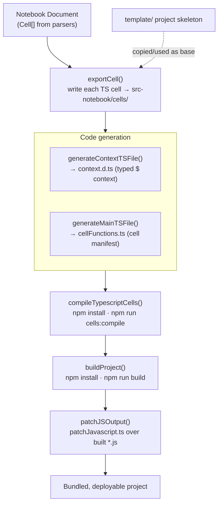

# Packager Package Onboarding Guide

## Section 1: Executive Summary

The `packager` package (`@typecell-org/packager`) turns a **TypeCell notebook into a standalone, buildable project**. Where the editor runs notebook cells *live in the browser*, the packager runs server-side (designed to execute inside an **AWS Lambda**) to produce a compiled, bundled artifact from the same cells.

**Think of it as the "export to a real app" button.** It takes the notebook's cell list, writes each TypeScript cell out as a source file inside a project template, generates the glue (type context + a manifest of cell functions), runs `npm install` + `npm run build`, and patches the JS output into something that can be served.

**Core responsibilities:**
1. **Export cells** — write each TypeScript cell to `src-notebook/cells/`.
2. **Generate glue** — a `context.d.ts` typing the shared `$` context from all cells, and a `cellFunctions.ts` manifest importing the built cells.
3. **Compile & build** — drive `npm` (TypeScript compile of cells, then the project build) in a Lambda-friendly environment.
4. **Patch output** — post-process the built JS (via `patchJavascript.ts`) into the runnable shape.

It was introduced in `#319` (`a294d2fc`, 2022-11) together with `parsers`. See [development-history.md](./development-history.md#epoch-4--tooling-modernization-2022).

> **Status caveat.** This is the least-exercised package in the current tree and carries Lambda-specific assumptions (hardcoded `/var/lang/bin/npm`, `/tmp/home`, `LAMBDA_TASK_ROOT`). Treat the existing code as a working reference for the *approach*, not as a clean module — verify behavior before relying on it in the rebuild.

---

## Section 2: Architecture

---

## Section 3: Component Breakdown (Explain the "Why")

### 3.1 `generate/generate.ts` — The orchestrator

**What it does:** Drives the whole pipeline: locate the cell directory, export TypeScript cells (`exportCell`), generate the type context and main manifest, compile, build, and patch.

**Why it exists:** A notebook's value is the live `$` context shared across cells. To turn that into a normal program, each cell must become a module and the cross-cell types must be reconstructed — `generateContextTSFile` does exactly that by importing every cell's exports into a single `IContext` interface.

**Analogy:** A **deployment factory** — raw notebook cells go in one end; a compiled, type-checked, bundled application comes out the other.

### 3.2 `generate/patchJavascript.ts` — Output transforms

**What it does:** `patchJSFileForTypeCell`, `patchJSFileWithWrapper`, and `getModulesFromPatchedFile` post-process the compiled JS so it matches TypeCell's module/execution conventions (the same AMD-style shape the `engine` expects).

**Why it exists:** TypeScript's raw output isn't directly runnable in TypeCell's module system; the patch step bridges the gap — conceptually the offline cousin of the engine's `modules.ts`.

### 3.3 `generate/process.ts` — Subprocess runner

**What it does:** `spawnCmd` wraps child-process execution for the `npm` invocations.

**Why it exists:** The build runs in a constrained Lambda runtime; centralizing process spawning keeps the env/PATH handling (`NPM_PATH`, `NPM_ENV`) in one place.

---

## Section 4: Public API / Boundaries

- **Internal dependencies:** `util`, `engine`, `parsers`.
- **Depended on by:** *(nothing in the core app)* — it's a leaf/standalone build tool, invoked out-of-band (e.g. a serverless export endpoint), not imported by `editor`.
- **External assumptions:** a `template/` project skeleton, an `npm` toolchain, and (currently) an AWS Lambda filesystem layout.

---

## Quick Reference: File → Responsibility

| File | One-line summary |
|------|------------------|
| `generate/generate.ts` | Pipeline: export cells → generate glue → compile → build → patch |
| `generate/patchJavascript.ts` | Post-process compiled JS into TypeCell module shape |
| `generate/process.ts` | `spawnCmd` subprocess wrapper for npm |
| `index.ts` | Entry/re-export |

---

## Rebuild Notes

- **Lowest priority / build in parallel.** Nothing in the running app depends on it, so it can trail the rebuild (see the rebuild sequence in [development-history.md](./development-history.md#part-2--recommended-rebuild-sequence)).
- **Decouple from Lambda.** The hardcoded `/var/lang/bin/npm`, `/tmp/home`, and `LAMBDA_TASK_ROOT` checks should become configuration. Consider whether **Vercel Functions / a Vercel Sandbox** is a better host than raw Lambda for the rebuild.
- The **`context.d.ts` generation** (reconstructing the shared `$` type from all cells) is the genuinely clever part and the thing to preserve; the npm-spawning build harness is replaceable.
- Reuses `parsers` (`cellsWithId`, `extensionForLanguage`) — keep that dependency; it's the right seam.

## Getting Started: Where to Look First

1. `generate/generate.ts` top-to-bottom — it reads as a linear pipeline.
2. `generateContextTSFile()` — how the cross-cell `$` context is reconstructed as types.
3. `generate/patchJavascript.ts` — compare against `engine/modules.ts` to see the live-vs-offline parallel.
