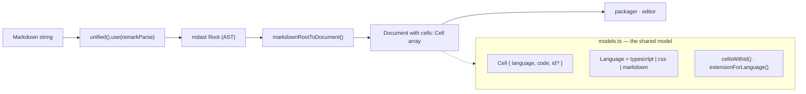

# Parsers Package Onboarding Guide

## Section 1: Executive Summary

The `parsers` package (`@typecell-org/parsers`) converts between TypeCell's **notebook document model** and **Markdown**. A TypeCell notebook is, at heart, an ordered list of typed cells (TypeScript, CSS, or Markdown). This package turns Markdown text into that cell list — and the underlying model is shared so the reverse path can stringify back out.

**Think of it as the import/export adapter** for the notebook format. It lets a `.md` file become a runnable notebook and gives `packager` a clean cell model to bundle.

**Core responsibilities:**
1. Define the **document/cell model** (`Document`, `Cell`, `Language`).
2. **Parse Markdown → Document** by walking a `remark` AST and grouping nodes into cells.
3. Provide small helpers (`cellsWithId`, `extensionForLanguage`) used by `packager`.

It was introduced alongside `packager` in `#319` (`a294d2fc`, 2022-11). See [development-history.md](./development-history.md#epoch-4--tooling-modernization-2022).

---

## Section 2: Architecture

---

## Section 3: Component Breakdown (Explain the "Why")

### 3.1 `models.ts` — The document model

**What it does:** Defines `Language` (`"typescript" | "css" | "markdown"`), `Cell` (`{ language, code, id? }`), `Document` (`{ cells }`), plus:
- `cellsWithId(cells)` — assigns positional string IDs.
- `extensionForLanguage(lang)` — maps a language to a file extension (`tsx`/`css`/`md`), using `util`'s `UnreachableCaseError` for exhaustiveness.

**Why it exists:** This is the **lingua franca** for notebooks outside the editor. `packager` writes cells to disk using these helpers; markdown parsing produces these types.

### 3.2 `markdown/parseMarkdown.ts` — Markdown → Document

**What it does:** Two functions:
- `markdownToDocument(markdown)` — parse with `remarkParse`, then delegate.
- `markdownRootToDocument(tree)` — walk the mdast children:
  - A **code block** with lang `typescript`/`css` (or none → defaults to `typescript`) becomes a code `Cell`. Any other language throws.
  - **Everything else** (paragraphs, headings, lists, …) is **coalesced into the trailing markdown cell**, re-stringified via `remarkStringify`, so consecutive prose stays in one cell.

**Why it works this way:** A TypeCell notebook interleaves prose and code. Mapping markdown's flat node stream onto that means: every fenced code block is its own runnable cell, and the prose between blocks collapses into markdown cells. The "append to last markdown cell" logic is what prevents every paragraph from becoming a separate cell.

**Analogy:** A **sorting line** — code blocks drop into their own bins; prose nodes get glued onto the current "prose" bin until the next code block starts a new section.

---

## Section 4: Public API / Boundaries

- **Exports** (`index.ts`): everything from `models.ts` and `markdown/parseMarkdown.ts` (`Document`, `Cell`, `CellWithId`, `Language`, `cellsWithId`, `extensionForLanguage`, `markdownToDocument`, `markdownRootToDocument`).
- **Internal dependencies:** `util`, `engine`.
- **Depended on by:** `packager`, `editor`.

> **Note on the `engine` dependency:** `parsers` declares `@typecell-org/engine` as a dependency. The markdown path itself is engine-independent; the coupling exists because the package shares the broader notebook/compilation model. When rebuilding, verify whether the markdown subset can be split from anything that genuinely needs `engine`, to keep the import lighter for `packager`.

---

## Quick Reference: File → Responsibility

| File | One-line summary |
|------|------------------|
| `models.ts` | `Document`/`Cell`/`Language` types + `cellsWithId`, `extensionForLanguage` |
| `markdown/parseMarkdown.ts` | Markdown → `Document` via a remark AST walk |
| `index.ts` | Re-exports the package surface |

---

## Rebuild Notes

- The model in `models.ts` is small and stable — a good early port. `packager` depends on it directly.
- The markdown round-trip is currently **one-directional in practice** (markdown → document); the reverse uses `remarkStringify` per-node. If the rebuild needs full Document → Markdown export, design it explicitly rather than assuming symmetry.
- Re-check the **`engine` dependency edge** (see note above) — it may be reducible.

## Getting Started: Where to Look First

1. `models.ts` — the cell/document types everything else speaks.
2. `markdown/parseMarkdown.ts` — the only real algorithm in the package.
