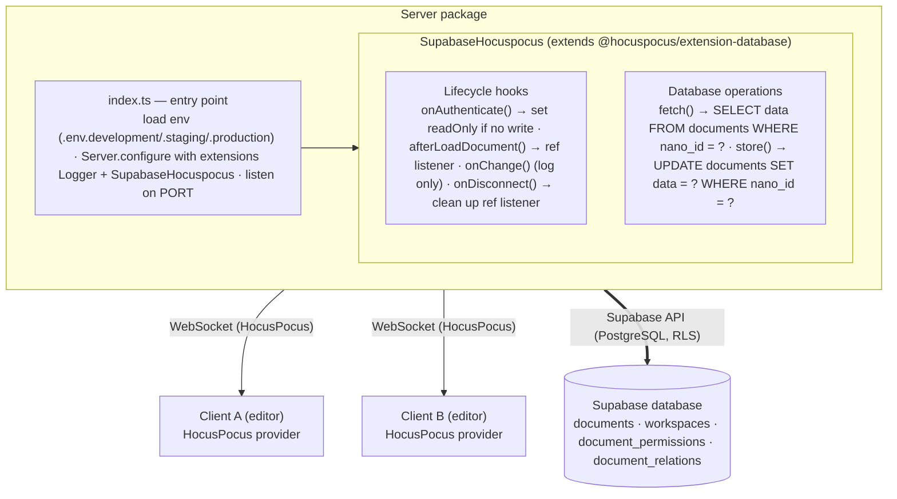
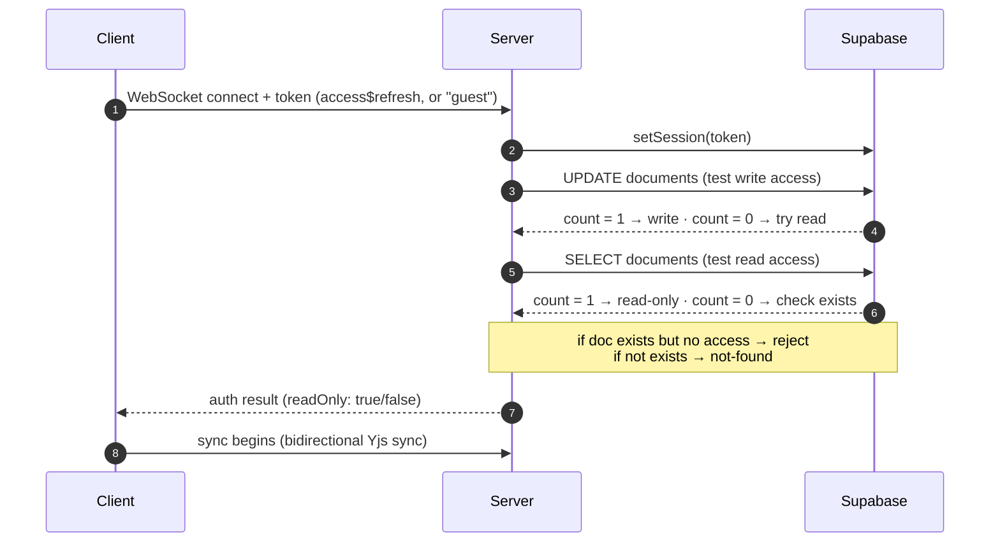
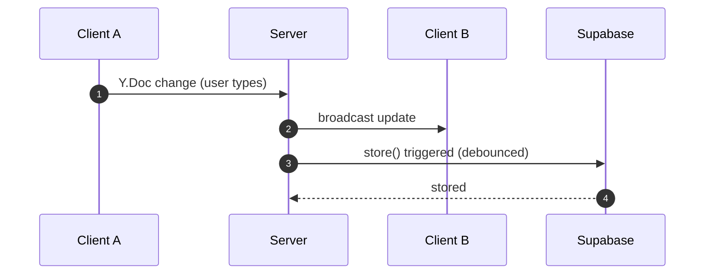
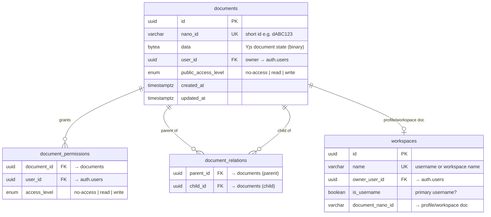
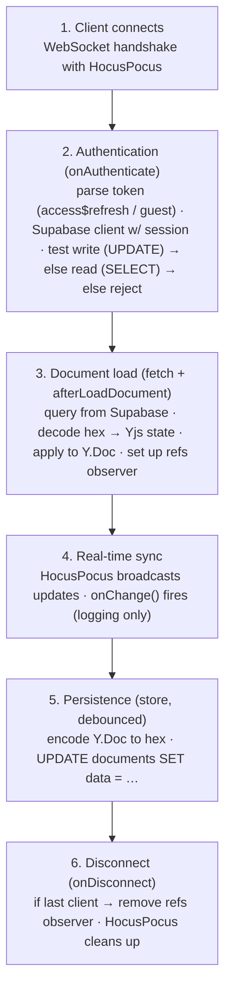
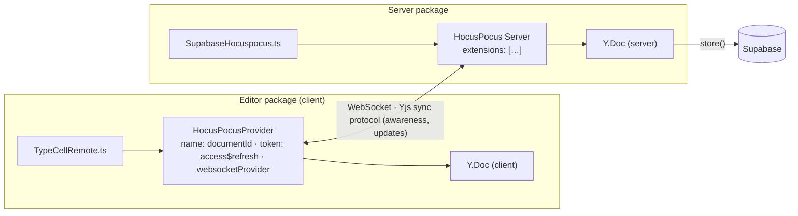

# Server Package Onboarding Guide

## Section 1: Executive Summary

The `server` package is the **backend collaboration server** — it's the bridge between multiple clients editing the same document in real-time. It runs a HocusPocus WebSocket server that syncs Yjs documents and persists them to Supabase.

**Think of it like a post office with a safety deposit box.** When you send a letter (document change), the post office (HocusPocus) delivers it to all recipients (other clients) instantly. It also keeps a copy in the vault (Supabase) so nothing is lost.

**Core Responsibilities:**
1. **Real-time sync** — Relay Yjs updates between connected clients via WebSocket
2. **Authentication** — Verify user tokens and determine read/write access
3. **Persistence** — Store document state in Supabase PostgreSQL
4. **Access control** — Enforce document permissions using Supabase RLS
5. **Relation tracking** — Maintain parent-child document relationships

**Key Technologies:**
- [HocusPocus](https://hocuspocus.dev/) — Yjs WebSocket sync server
- [Supabase](https://supabase.com/) — PostgreSQL database with Row Level Security
- [Yjs](https://docs.yjs.dev/) — CRDT for conflict-free document merging

**Architecture Overview:** The server is remarkably simple — it's essentially HocusPocus with a custom Supabase extension. HocusPocus handles all the WebSocket complexity, and our extension plugs in authentication and persistence.

---

## Section 2: Architecture



### Connection & authentication flow



### Document sync flow



---

## Section 3: Component Breakdown (Explain the "Why")

### 3.1 `index.ts` — The Bootstrap

**What it does:** Loads environment configuration and starts the HocusPocus server.

**Why it's so simple:** HocusPocus does the heavy lifting. Our job is just to configure it with the right extensions. The entire server entry point is ~20 lines of code.

**Environment Modes:**
- `development` — Local Supabase instance
- `staging` — Staging Supabase project
- `production` — Production Supabase project

### 3.2 `SupabaseHocuspocus.ts` — The Brain

**What it does:** A HocusPocus extension that handles authentication, authorization, and persistence using Supabase.

**Why it exists:** HocusPocus is storage-agnostic. It provides hooks for you to plug in your own database. This extension:
- Authenticates users using Supabase JWT tokens
- Checks permissions using Row Level Security
- Loads and stores documents as binary blobs
- Tracks document relationships (parent-child)

**Analogy:** Like a bouncer + vault keeper at a club. The bouncer checks IDs (authentication), decides who gets VIP access (authorization), and the vault keeper stores everyone's coats (persistence).

### 3.3 Authentication Flow

**What happens when a client connects:**

1. Client sends token: `access_token$refresh_token` (or `"guest"`)
2. Server creates Supabase client with that session
3. Server tests write access: `UPDATE documents SET updated_at = now() WHERE nano_id = ?`
   - If count = 1 → User has write access
4. Server tests read access: `SELECT ... WHERE nano_id = ?`
   - If count = 1 → User has read-only access
5. Server checks if document exists (using service account):
   - If exists → No access, reject
   - If not exists → Document not found, reject

**Why this dance?** Supabase RLS policies are evaluated on every query. By attempting operations, we let the database tell us what's allowed. This keeps authorization logic in one place (SQL policies) rather than duplicating it in the server.

### 3.4 Persistence: `fetch()` and `store()`

**fetch()** — Load document when first client connects:
```typescript
const ret = await supabase.from("documents").select().eq("nano_id", documentName);
const decoded = Buffer.from(ret.data[0].data.substring(2), "hex"); // skip \x prefix
return decoded;
```

**store()** — Save document when changes occur:
```typescript
await serviceClient.from("documents")
  .update({ data: "\\x" + state.toString("hex") })
  .eq("nano_id", documentName);
```

**Why hex encoding?** PostgreSQL `bytea` columns expect hex-encoded data prefixed with `\x`. We encode/decode when reading/writing.

**Why use serviceClient for writes?** The service client bypasses RLS, ensuring we can always persist. User permissions were already verified during authentication.

### 3.5 Document Relations: `refsChanged()`

**What it does:** Watches for changes to the document's `refs` map and syncs parent-child relationships to the `document_relations` table.

**Why it exists:** TypeCell documents can reference other documents (e.g., a workspace containing multiple notebooks). These relationships:
- Enable cascading permissions (access to parent grants access to children)
- Support hierarchical navigation
- Allow querying "all documents in this workspace"

**How it works:**
1. Listen to `doc.getMap("refs").observeDeep()`
2. When refs change, compare with existing relations in database
3. `INSERT` new relations, `DELETE` removed ones

---

## Section 4: Database Schema

### Tables Overview



> `document_permissions` is unique on `(document_id, user_id)`; `document_relations` is unique on `(parent_id, child_id)`.

### Row Level Security (RLS) Policies

The database enforces access control through RLS policies. Key rules:

**documents:**
- `SELECT`: Public if `public_access_level >= 'read'`, OR owner, OR has permission via `document_permissions` or inherited from parent
- `INSERT`: Only authenticated users, only for their own `user_id`
- `UPDATE`: Same as SELECT but requires `>= 'write'`
- `DELETE`: Only owner

**Access Inheritance:** The `check_document_access()` function recursively checks parent documents:
```sql
-- If user has direct permission, use it
SELECT access_level FROM document_permissions WHERE user_id = uid AND document_id = doc_id

-- Otherwise, check parent permissions (recursive)
SELECT MIN(check_document_access(uid, parent_id))
FROM document_relations WHERE child_id = doc_id
```

### Domain Validations

```sql
-- Document IDs must match pattern: d followed by 5+ alphanumeric chars
document_nano_id_domain: '^d[0-9A-Za-z]{5,}(/\.inbox)?$'

-- Usernames: 3-20 chars, alphanumeric + underscore, starts with letter
name_domain: '^[A-Za-z][A-Za-z0-9_]*$'
-- Cannot contain 'typecell' or 'admin' (case insensitive)
```

---

## Section 5: Key Relationships and Data Flow

### The Complete Request Lifecycle



### Server ↔ Client Relationship



---

## Public API / Boundaries

- **Internal dependencies:** `shared` (the `schema.ts` types + `Ref` definitions), `shared-test` (test harness), `util`.
- **Depended on by:** nothing — it's a standalone Node process (the deployable backend).
- **Cross-boundary role:** the **only writer to Supabase document state**. Clients ([`editor`](./editor-onboarding-guide.md)) connect via HocusPocus WebSocket; authorization is delegated to **Postgres RLS**, not enforced in server code.

---

## Rebuild Notes

- **Keep authorization in the database.** The "attempt the operation and let RLS answer" pattern in `onAuthenticate` is deliberate — it keeps one source of truth (SQL policies). Don't reimplement permission logic in the server.
- **The recursive `check_document_access()` function is the crux of access inheritance** (parent grants flow to children). Migrate it carefully and cover it with the existing access-control tests.
- **`shared/schema.ts` is generated from these migrations** (`npm run gentypes`). Treat the migrations as the source of truth and regenerate the shared types in the build (see [shared-onboarding-guide.md](./shared-onboarding-guide.md)).
- This replaced the Matrix backend in V3 (`#339`); there is no Matrix code to carry forward (see [development-history.md](./development-history.md#epoch-5--v3-the-big-rewrite-2023-q3-)).
- **Deployment note:** this is a long-lived WebSocket server. On Vercel, that points to a separately-hosted Node process or Fluid Compute function rather than a standard serverless endpoint — decide the host early in the rebuild.

---

## Quick Reference: File → Responsibility

| File | One-Line Summary |
|------|------------------|
| `src/index.ts` | Entry point: load env, configure HocusPocus, listen |
| `src/hocuspocus/extension-supabase/SupabaseHocuspocus.ts` | Auth, persistence, relations tracking |
| `supabase/migrations/*.sql` | Database schema and RLS policies |
| `supabase/seed.sql` | Initial data for local development |
| `src/supabase/test/*.test.ts` | Database access control tests |

---

## Common Commands

```bash
# Start local Supabase (Docker)
npm run start:supabase

# Stop local Supabase
npm run stop:supabase

# Start server in development mode
npm run dev

# Run tests
npm test

# Generate TypeScript types from database schema
npm run gentypes

# Create a new migration
npm run migrate

# Show pending schema changes
npm run diff
```

---

## Getting Started: Where to Look First

1. **Start with `index.ts`** — See how simple the server setup is. It's just HocusPocus + extensions.

2. **Read `SupabaseHocuspocus.ts`** — This is where all the logic lives. Focus on:
   - `onAuthenticate()` — How access is determined
   - `fetch()` / `store()` — How documents are persisted

3. **Study `migrations/20230324133839_initial.sql`** — Understand the database schema and RLS policies. The recursive `check_document_access()` function is particularly important.

4. **Run the tests** — `npm test` runs access control tests that demonstrate how permissions work.

The server is intentionally simple. Most complexity is pushed to either HocusPocus (sync protocol) or Supabase (access control, persistence). Our code is just the glue.
