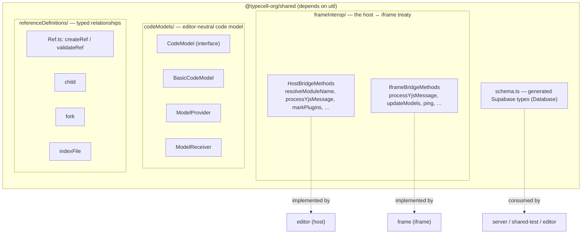

# Shared Package Onboarding Guide

## Section 1: Executive Summary

The `shared` package (`@typecell-org/shared`) is the **contract** between the major runtime boundaries of TypeCell. It contains no business logic of its own — instead it defines the **types and interfaces** that two otherwise-isolated worlds agree on:

- **Host ↔ iframe** — the editor (parent window) and the sandboxed `frame` (iframe) can only talk through PostMessage. `shared` defines the exact method signatures each side exposes.
- **Client ↔ database** — the auto-generated Supabase `schema.ts` is the single source of truth for table shapes, shared by `editor`, `server`, and `shared-test`.

**Think of it as the treaty document** both sides sign. If `shared` says the host exposes `resolveModuleName(name): Promise<string>`, then the frame can call it and the host must implement it — type-checked at compile time on both ends.

**Core responsibilities:**
1. **Frame interop contracts** — `HostBridgeMethods` and `IframeBridgeMethods`.
2. **Code model abstraction** — a transport-neutral `CodeModel` interface (so the engine doesn't depend on Monaco directly).
3. **Reference system** — `Ref` types and helpers for typed relationships between documents (children, forks, index entries).
4. **Database schema** — generated Supabase types (`schema.ts`).

---

## Section 2: Architecture

---

## Section 3: Component Breakdown (Explain the "Why")

### 3.1 `frameInterop/HostBridgeMethods.ts` & `IframeBridgeMethods.ts`

**What they do:** Define the two halves of the cross-iframe RPC surface.

- **`HostBridgeMethods`** (host exposes, iframe calls): `resolveModuleName`, `registerTypeCellModuleCompiler`, `unregisterTypeCellModuleCompiler`, `processYjsMessage`, `markPlugins`. This is how sandboxed code asks the trusted host to fetch/compile another TypeCell notebook, or tunnels Yjs updates back.
- **`IframeBridgeMethods`** (iframe exposes, host calls): `processYjsMessage`, `updateModels` / `updateModel` / `deleteModel`, `ping`. This is how the host pushes code-model changes and Yjs updates into the sandbox.

**Why they exist:** The iframe boundary is a hard security wall. These typed interfaces are the *only* sanctioned way across it. Putting them in `shared` means both sides are checked against the same definition.

**Analogy:** A **diplomatic pouch** — a fixed, agreed list of what may pass through the embassy gate, in each direction.

### 3.2 `codeModels/` — Editor-neutral code model

**What it does:** `CodeModel` is a minimal interface (`getValue()`, `onDidChangeContent`, `path`, `language`, `uri`) that represents "a piece of editable code" without referencing Monaco. `BasicCodeModel` is a plain implementation; `ModelProvider`/`ModelReceiver` move models across the bridge.

**Why it exists:** The `engine` must execute code without knowing whether it came from Monaco, a markdown parse, or a test. This interface is the decoupling layer.

### 3.3 `referenceDefinitions/` & `Ref.ts` — Typed relationships

**What it does:** Defines a `Ref<T>` (id, namespace, type, target, optional sortKey) and `createRef`/`validateRef`. Reference *kinds* (`child`, `fork`, `indexFile`) describe relationships between documents, including whether a relationship is unique or "many" and sorted.

**Why it exists:** Documents relate to each other (a fork points at its origin; an index lists children). Modeling these as validated, typed references — rather than ad-hoc fields — keeps the relationship graph consistent across client and server.

### 3.4 `schema.ts` — Generated database types

**What it does:** A generated `Database` type describing Supabase tables (e.g. `documents`, `document_permissions`) and enums (`access_level`).

**Why it exists:** One source of truth for the DB shape. Regenerate it with `npm run gentypes` (from `packages/server`) whenever the schema changes — never hand-edit.

---

## Section 4: Public API / Boundaries

- **Exports** (`index.ts`): `Ref` helpers, the `codeModels/*` types, both `frameInterop` method types, the `referenceDefinitions/*`, and `schema.ts`.
- **Internal dependencies:** `util`.
- **Depended on by:** `engine`, `frame`, `server`, `editor`.

---

## Quick Reference: File → Responsibility

| File | One-line summary |
|------|------------------|
| `frameInterop/HostBridgeMethods.ts` | Methods the host exposes to the iframe |
| `frameInterop/IframeBridgeMethods.ts` | Methods the iframe exposes to the host |
| `codeModels/CodeModel.ts` | Editor-neutral "piece of code" interface |
| `codeModels/BasicCodeModel.ts` | Plain `CodeModel` implementation |
| `codeModels/ModelProvider.ts` / `ModelReceiver.ts` | Move code models across the bridge |
| `Ref.ts` | `createRef` / `validateRef` + `Ref<T>` type |
| `referenceDefinitions/{child,fork,indexFile}.ts` | Concrete reference kinds |
| `schema.ts` | Generated Supabase `Database` types |

---

## Rebuild Notes

- **`schema.ts` is generated** — wire `npm run gentypes` into the rebuild from day one and treat the file as a build artifact.
- The **frameInterop types are the most important thing in this package.** They are the seam between `editor` (host) and `frame` (iframe). Get them right before building either side; they pair with `y-penpal` (transport) — see [y-penpal-onboarding-guide.md](./y-penpal-onboarding-guide.md).
- Keep `CodeModel` free of any Monaco/BlockNote imports — that decoupling is what lets `engine` stay editor-agnostic.

## Getting Started: Where to Look First

1. `frameInterop/HostBridgeMethods.ts` + `IframeBridgeMethods.ts` — the architecture's central contract.
2. `codeModels/CodeModel.ts` — the engine's view of "code".
3. `Ref.ts` — the relationship model.
4. `schema.ts` — the data model (read-only; it's generated).
