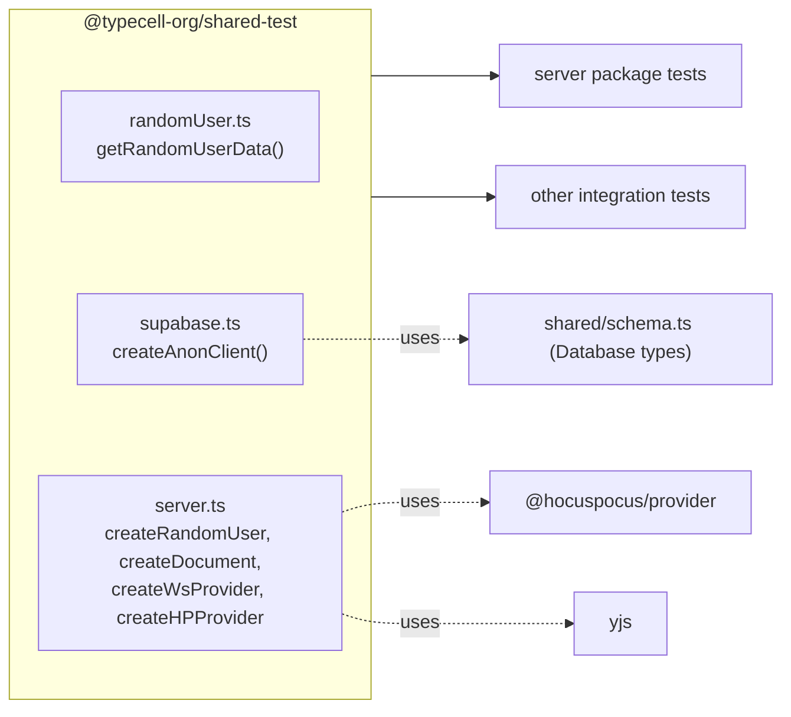

# shared-test Package Onboarding Guide

## Section 1: Executive Summary

The `shared-test` package (`@typecell-org/shared-test`) is a small **test-support library**: fixtures and client factories that more than one package needs when writing integration tests against the real collaboration stack (Supabase + HocusPocus + Yjs).

**Think of it as the test green-room** — it spins up the props (random users, anonymous Supabase clients, HocusPocus providers, sample documents) so each test file doesn't reinvent that setup.

**Core responsibilities:**
1. **Random users** — generate user data and sign them up against Supabase (`createRandomUser`).
2. **Supabase clients** — anonymous client factory (`createAnonClient`).
3. **HocusPocus providers** — websocket + document provider factories for driving sync in tests.
4. **Sample documents** — `createDocument(...)` building a schema-shaped row.

---

## Section 2: Architecture

---

## Section 3: Component Breakdown (Explain the "Why")

### 3.1 `randomUser.ts` — Identity fixtures

**What it does:** `getRandomUserData(name)` produces credentials/profile data for a throwaway user.

**Why it exists:** Permission and collaboration tests need *real* distinct users (RLS is enforced in Postgres — you can't fake auth). Generating fresh users keeps tests isolated and repeatable.

### 3.2 `supabase.ts` — Client factory

**What it does:** `createAnonClient(env)` builds a Supabase client from `VITE_TYPECELL_SUPABASE_URL` / `VITE_TYPECELL_SUPABASE_ANON_KEY`.

**Why it exists:** Centralizes env-driven client creation so tests (browser or node) get a consistent, correctly-configured client.

### 3.3 `server.ts` — Collaboration harness

**What it does:** The richest file. Provides:
- `createRandomUser(name, env)` — sign a random user up via Supabase and return `{ user, session, supabase }`.
- `createDocument(userId, data, public_access_level)` — build a `documents`-shaped row (with `uniqueId.generateUuid()` / `generateId("document")`).
- `createWsProvider(url, ws?)` — a `HocuspocusProviderWebsocket` (accepts a `ws` polyfill for node).
- `createHPProvider(docId, ydoc, token, wsProvider)` — a `HocuspocusProvider` bound to a `Y.Doc`.

**Why it exists:** Driving a real sync session in a test means: a user, a token, a websocket, and a Yjs doc wired to HocusPocus. This file assembles those pieces so server tests read as scenarios, not boilerplate. The `ws` polyfill parameter is what lets the same helpers run under node (where there's no browser `WebSocket`).

**Analogy:** A **stage crew** that has the lights, mics, and actors ready before the scene (test) starts.

---

## Section 4: Public API / Boundaries

- **Exports** (`index.ts`): everything from `randomUser.ts`, `server.ts`, `supabase.ts`.
- **Internal dependencies:** **none** declared (it pulls `util` transitively for IDs; primary deps are `@supabase/supabase-js`, `@hocuspocus/provider`, `yjs`).
- **Depended on by:** `server` (as a dev/test dependency).
- **Environment:** requires Supabase URL + anon key in env to do anything live.

---

## Quick Reference: File → Responsibility

| File | One-line summary |
|------|------------------|
| `randomUser.ts` | Generate throwaway user credentials/profile |
| `supabase.ts` | Anonymous Supabase client factory |
| `server.ts` | Random-user signup, sample docs, HocusPocus providers |
| `index.ts` | Re-exports the package surface |

---

## Rebuild Notes

- **Foundation-tier for tests** — no internal deps, so it can be built early, but it's only meaningful once `server`/Supabase exist. Build the helpers as the server tests need them.
- Keep the **node `ws` polyfill seam** (`createWsProvider(url, ws?)`) — losing it breaks running collaboration tests outside a browser.
- These helpers hardcode the `documents` row shape; keep them in lockstep with `shared/schema.ts` so a schema change surfaces here at compile time.

## Getting Started: Where to Look First

1. `server.ts` — the end-to-end "make a user + a doc + a sync provider" helpers.
2. `supabase.ts` — how env config becomes a client.
