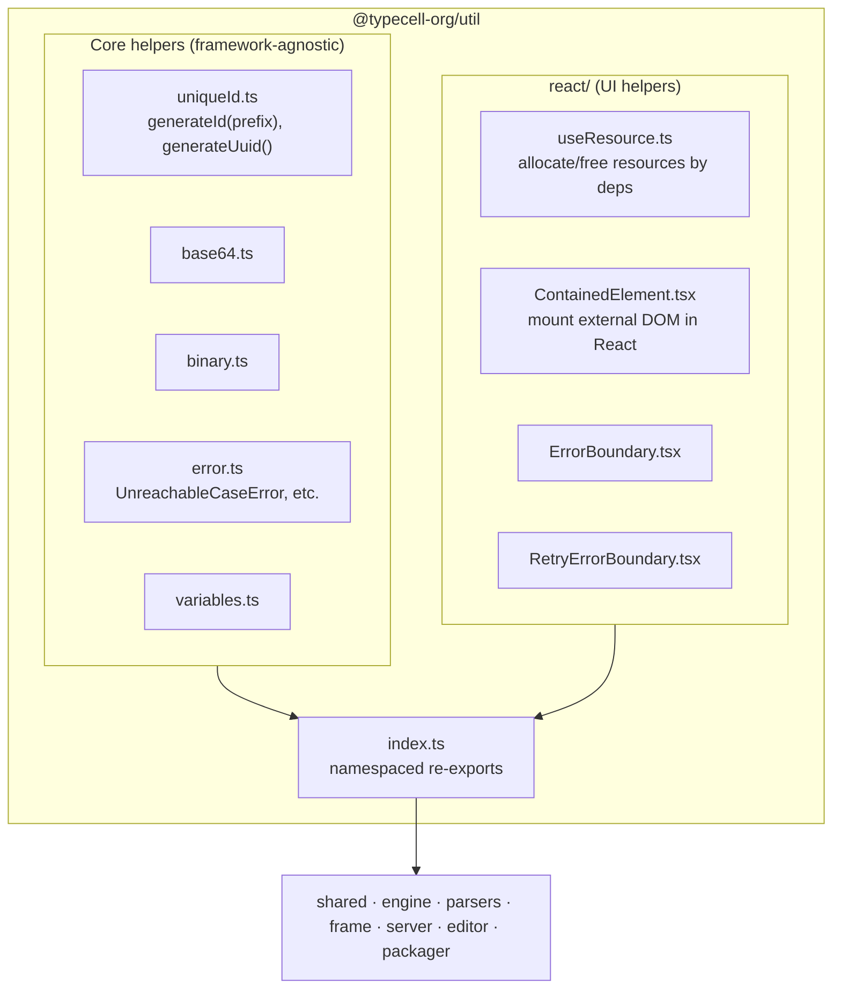

# Util Package Onboarding Guide

## Section 1: Executive Summary

The `util` package (`@typecell-org/util`) is the **toolbox** at the bottom of the dependency stack. It holds small, generic helpers with **no internal dependencies** — which is exactly why nearly every other package depends on it.

**Think of it like the standard library** every other package reaches for: ID generation, encoding, error helpers, and a handful of carefully-written React hooks for managing resources whose lifetime doesn't match a component's render.

**Core responsibilities:**
1. **Identifiers** — UUIDs and nano-IDs with type-prefixed helpers.
2. **Encoding** — base64 and binary buffer helpers.
3. **Errors** — typed error utilities (e.g. exhaustiveness checks).
4. **React resource hooks** — `useResource`, error boundaries, and a "contained element" helper for rendering DOM produced outside React.

Because it sits at the foundation, `util` should be **rebuilt first** (see [development-history.md](./development-history.md#part-2--recommended-rebuild-sequence)).

---

## Section 2: Architecture

The package re-exports the core helpers as **namespaces** (`base64`, `binary`, `error`, `uniqueId`, `variables`) and the React helpers as **flat exports**, all from `index.ts`.

---

## Section 3: Component Breakdown (Explain the "Why")

### 3.1 `uniqueId.ts` — Identifiers

**What it does:** Generates UUIDs (`generateUuid`) and short, type-prefixed nano-IDs (`generateId("document")`, `generateId("reference")`).

**Why it exists:** Documents, references, and other entities need stable IDs that are safe to use as keys and across the network. Prefixed IDs make logs and debugging far easier ("is this a `document_` or a `reference_`?").

### 3.2 `base64.ts` / `binary.ts` — Encoding

**What they do:** Convert between binary buffers and string representations.

**Why they exist:** Yjs updates and other payloads are binary. Sending them across boundaries (PostMessage, storage, the network) often requires a string-safe encoding.

### 3.3 `error.ts` — Typed errors

**What it does:** Provides error helpers, including an `UnreachableCaseError` used for exhaustive `switch` checks (you'll see it in `parsers`' `extensionForLanguage`).

**Why it exists:** Turns "impossible" runtime states into compile-time guarantees. If a new enum case is added and a `switch` isn't updated, TypeScript flags it.

### 3.4 `react/useResource.ts` — Resource lifecycle hook

**What it does:** Allocates a resource `[value, dispose]` tied to a dependency list, using `useSyncExternalStore`, and disposes it correctly when deps change or the component unmounts.

**Why it exists:** The editor and frame create long-lived, imperative objects (Yjs docs, engines, Monaco models) that don't map cleanly onto React state. `useResource` is the safe bridge — it guarantees the old resource is disposed before a new one is created.

**Analogy:** A **coat check** — hand it something to hold, get a claim ticket (the value), and it's reliably returned/destroyed when you're done.

### 3.5 `react/ContainedElement.tsx` — Mounting external DOM

**What it does:** Renders a raw DOM node (produced outside React) inside a React tree.

**Why it exists:** Monaco editors and other imperative widgets create their own DOM. This component is the controlled "slot" where that DOM lives.

### 3.6 `react/ErrorBoundary.tsx` & `RetryErrorBoundary.tsx`

**What they do:** Catch render errors; the retry variant allows recovering without a full reload.

**Why they exist:** User code and dynamically-imported modules can throw. Boundaries keep one bad cell from taking down the whole app.

---

## Section 4: Public API / Boundaries

- **Exports:** namespaces `base64`, `binary`, `error`, `uniqueId`, `variables`; flat React helpers `useResource`, `ContainedElement`, `ErrorBoundary`, `RetryErrorBoundary`.
- **Internal dependencies:** **none** (foundation package).
- **Depended on by:** `shared`, `engine`, `parsers`, `packager`, `frame`, `server`, `editor`.

---

## Quick Reference: File → Responsibility

| File | One-line summary |
|------|------------------|
| `uniqueId.ts` | UUID + prefixed nano-ID generation |
| `base64.ts` / `binary.ts` | Binary ⟷ string encoding |
| `error.ts` | Typed error helpers (exhaustiveness checks) |
| `variables.ts` | Misc variable/name helpers |
| `react/useResource.ts` | Allocate/dispose imperative resources by deps |
| `react/ContainedElement.tsx` | Mount externally-created DOM in React |
| `react/ErrorBoundary.tsx` | Catch render errors |
| `react/RetryErrorBoundary.tsx` | Catch + allow retry |

---

## Rebuild Notes

- **Build this first.** It has zero internal dependencies and everything else needs it.
- Keep the **namespaced export shape** (`uniqueId.generateId(...)`) — consumers across `shared`, `engine`, and `server` rely on it.
- `useResource` is subtle (it uses `useSyncExternalStore` to get disposal timing right). Port it verbatim and cover it with tests before building anything that consumes it; resource leaks here surface as hard-to-debug duplicate engines/models elsewhere.

## Getting Started: Where to Look First

1. `index.ts` — see the full surface area at a glance.
2. `uniqueId.ts` — the most widely-used helper.
3. `react/useResource.ts` — the most subtle, and the one most worth understanding before touching `frame`/`editor`.
