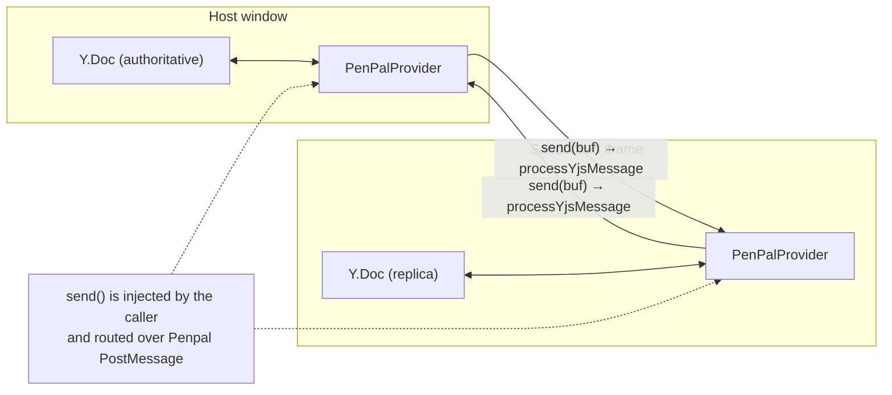
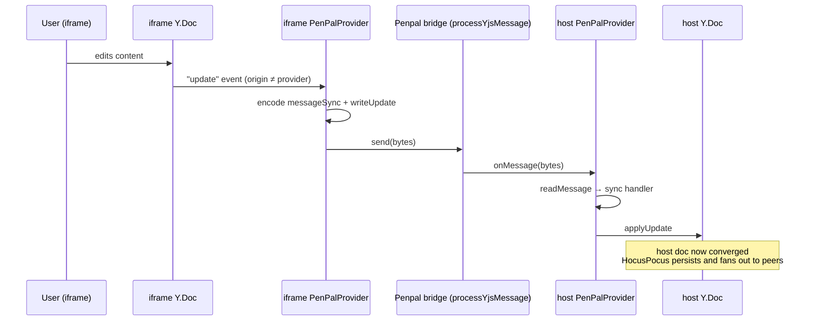

# y-penpal Package Onboarding Guide

## Section 1: Executive Summary

The `y-penpal` package (`@typecell-org/y-penpal`) is the **transport pipe** that carries collaborative document state across the iframe boundary. It is a single file (~270 lines) but architecturally critical.

TypeCell runs user code in a **sandboxed iframe**. The collaborative document (a Yjs CRDT) lives in the host, but the iframe needs a synchronized copy to render and execute against. `y-penpal` is a **custom Yjs provider** that keeps the two copies in sync — not over a WebSocket, but over **Penpal / PostMessage**.

**Think of it as `y-websocket` with the websocket removed.** The code is explicitly *"based on y-websocket, but with the websocket stuff stripped out and broadcastchannel replaced with handlers that can be connected to penpal / iframe PostMessage"* (see the file header). It speaks the same Yjs sync + awareness protocol; only the wire changed.

**Core responsibilities:**
1. **Sync** the Yjs document between host and iframe (sync protocol step 1/step 2 + incremental updates).
2. **Awareness** — propagate presence/cursor state across the boundary.
3. **Pluggable transport** — instead of owning a socket, it takes a `send(buf, provider)` callback, so the caller wires it to whatever channel they have (here, Penpal).

It was introduced in the V3 rewrite (`#365`, `765abfa0`, 2023-09). See [development-history.md](./development-history.md#epoch-5--v3-the-big-rewrite-2023-q3-).

---

## Section 2: Architecture

`PenPalProvider` does **not** know about Penpal. It only knows: "when I have bytes to send, call the `send` callback I was given; when bytes arrive, call `onMessage`." The host/frame code wires those two ends to the `processYjsMessage` bridge methods defined in [`shared`](./shared-onboarding-guide.md).

### Message types

The provider implements four Yjs message kinds, mirroring `y-websocket`:

| Constant | Value | Meaning |
|---|---|---|
| `messageSync` | 0 | Yjs sync protocol (step1 / step2 / update) |
| `messageAwareness` | 1 | Awareness (presence) update |
| `messageAuth` | 2 | Auth/permission denial notice |
| `messageQueryAwareness` | 3 | Request peer's awareness state |

---

## Section 3: Component Breakdown (Explain the "Why")

### 3.1 `PenPalProvider` (class)

**What it does:** Extends `lib0`'s `Observable`. On construction it subscribes to the local `Y.Doc`'s `update` events and the `Awareness` `update` events; whenever the local doc changes, it encodes a sync message and hands it to `send()`. Incoming bytes are decoded by `readMessage` and dispatched to the matching handler.

**Why it exists:** Yjs needs *some* provider to move updates between replicas. The off-the-shelf providers assume a socket or BroadcastChannel; the iframe boundary is neither. This class supplies the protocol logic while leaving the wire pluggable.

**Analogy:** A **bilingual courier** who knows the Yjs "language" (sync + awareness) perfectly but doesn't own a vehicle — you tell it how to deliver each envelope (`send`), and you hand it envelopes as they arrive (`onMessage`).

### 3.2 The handshake — `connect()`

On `connect()` the provider performs the standard Yjs opening exchange in order:
1. **sync step 1** (state vector) — "here's what I have, tell me what I'm missing".
2. **sync step 2** — broadcast local state so the peer can catch up.
3. **queryAwareness** — ask the peer for its presence state.
4. **awareness update** — broadcast local presence.

This guarantees both replicas converge immediately on connection, and presence (who's here, cursors) lights up right away.

### 3.3 Update propagation — `_updateHandler` / `_awarenessUpdateHandler`

**What they do:** Local Yjs/awareness changes are encoded and broadcast via `send()` — but only when the change did **not** originate from this provider (`origin !== this`), which prevents echo loops.

**Why it matters:** Without the origin check, applying a remote update would re-broadcast it, ping-ponging forever.

### 3.4 `onMessage(data, origin)` — the inbound door

**What it does:** The caller invokes this with bytes received over Penpal. It decodes, runs the appropriate handler, and if the handler produced a reply (encoder length > 1), sends it back.

### 3.5 `synced` getter/setter & `destroy()`

**What they do:** `synced` flips true after the first successful sync-step-2 and emits `synced`/`sync` events. `destroy()` removes all listeners (doc, awareness, window `unload`/process `exit`) and clears awareness state — essential to avoid leaks when an iframe is torn down.

---

## Section 4: Key Relationships and Data Flow

### A document update crossing the boundary

The host's `Y.Doc` is the one connected (via HocusPocus) to the server, so an iframe edit flows: **iframe doc → y-penpal → host doc → HocusPocus → server → other clients.**

---

## Public API / Boundaries

- **Exports:** `PenPalProvider`, message-type constants (`messageSync`, `messageAwareness`, `messageAuth`, `messageQueryAwareness`).
- **Internal dependencies:** **none** (depends only on `y-protocols` and `lib0`).
- **Depended on by:** `frame`, `editor`.
- **Pairs with:** the `processYjsMessage` methods in [`shared/frameInterop`](./shared-onboarding-guide.md) (the actual Penpal wiring lives in `frame`/`editor`).

---

## Rebuild Notes

- **Build this early** (foundation tier) — it has no internal deps and both `frame` and `editor` need it.
- It is a **near-fork of `y-websocket`.** When rebuilding, start from the current upstream `y-websocket` and re-apply the same surgery (strip socket/BroadcastChannel, expose `send`/`onMessage`) rather than hand-porting line by line — that keeps it aligned with the Yjs protocol version you adopt.
- The **origin check** (`origin !== this`) and **`destroy()` cleanup** are the two easiest things to get subtly wrong; both cause real bugs (echo storms, leaked iframes). Cover them with tests.
- Keep the transport pluggable (the `send` callback). Do **not** import Penpal here — that coupling belongs in `frame`/`editor`.

## Getting Started: Where to Look First

1. The file header comment — states the `y-websocket` lineage and intent.
2. `connect()` — the 4-step handshake is the clearest summary of what the provider does.
3. `_updateHandler` + `onMessage` — the outbound and inbound halves of steady-state sync.
