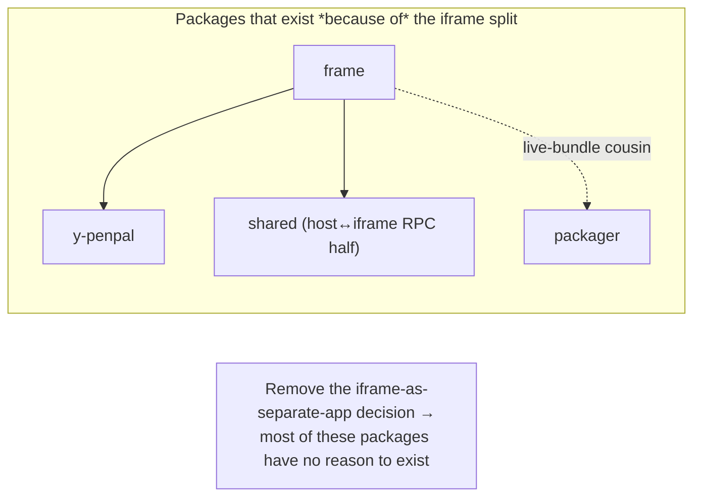
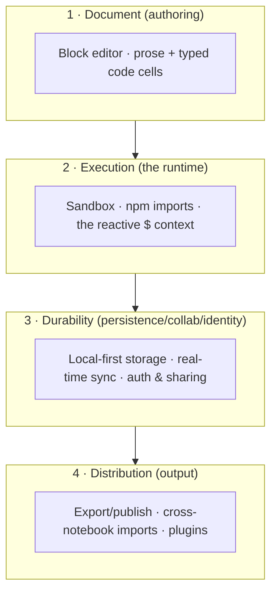
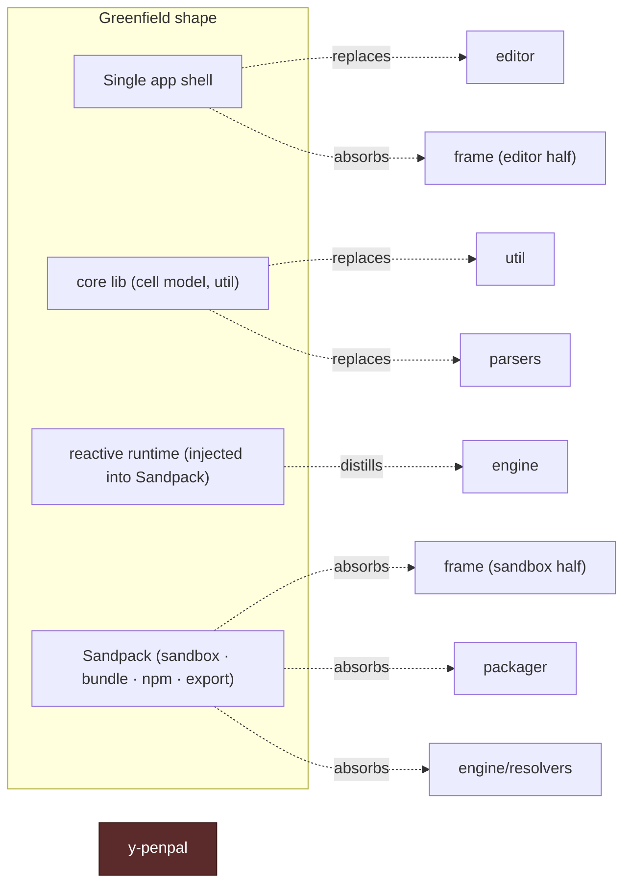

# Greenfield Build Guide — A Reactive Notebook from First Principles

> **What this is.** A *from-idea-to-implementation* build path for a new project **inspired by**
> TypeCell, but built greenfield. Where [development-history.md](./development-history.md) Part 2
> prescribes a *1-for-1 rebuild* ordered by the **current package dependency graph**
> (`util → shared → engine → frame → editor …`), this guide is ordered by the **feature set**:
> the sequence a junior/mid-level engineer would follow, each step a shippable vertical slice.
>
> **What this is not.** A faithful re-derivation of the existing code. It deliberately drops
> decisions that exist only because of the current architecture — most of all the
> *iframe-as-separate-app* split. Stack choices (and *why* we diverge) live in
> [stack-decisions.md](./stack-decisions.md); read the two together.

## Committed stack

These choices are **decided**, not open options — the milestones below assume them. The full
rationale and the alternatives considered live in [stack-decisions.md](./stack-decisions.md).

| Concern | Decision |
|---|---|
| **App framework** | **Vite + React SPA** (the [M0 quickstart](#m0-quickstart-runnable) is the reference stack) |
| **Editor** | **Tiptap-direct + [Tiptap UI Components](https://tiptap.dev/docs/ui-components/getting-started/overview)** — code cells are raw Tiptap NodeViews |
| **Execution / sandbox** | **Sandpack** for sandbox + bundle + npm + export |
| **Reactivity** | a **custom injected `$` runtime** on top of Sandpack (fine-grained re-run); primitive (MobX vs signals) decided by an [M3 spike](#m3--many-cells--the-reactive--context--the-special-sauce) |
| **Collaboration** | **Yjs** via a **managed provider** (Liveblocks / y-sweet / PartyKit) |
| **Persistence / auth** | **Supabase** (auth + DB + cascading permissions) |

> The architecture is portable — Tiptap, Yjs, and Sandpack are all framework-agnostic — but this
> guide commits to one concrete stack so every milestone is runnable rather than hypothetical.

---

## Why the existing rebuild plan isn't the greenfield plan

The current plan is dependency-graph-driven, which makes it accurate to the running system — and
that is exactly the problem for a greenfield build. The graph encodes V3's constraints:



The single biggest greenfield lever is to stop shipping the editor's runtime as a *second
application* living in a sandboxed iframe that you hand-sync with Yjs-over-PostMessage. A
purpose-built sandbox library (**Sandpack**) gives you the *security* of the iframe boundary
**without** making you build and synchronize a whole second app across it. That one change
collapses `frame`, `y-penpal`, half of `shared`, and `packager`. See
[stack-decisions.md §1](./stack-decisions.md#1-execution--sandboxing-the-big-one).

---

## Part 0 — First principles: what we're actually building

**In one sentence:** *A reactive notebook — rich-text prose interleaved with live TypeScript/React
code cells that share reactive state, run sandboxed in-browser with runtime npm imports, and are
editable collaboratively.*

Everything else is a consequence of that sentence. Pull it apart into **four orthogonal
concerns** — note these are *concerns*, not packages. Each milestone in Part 1 adds capability to
one concern without rewriting the others.



### The one data model everything hangs off

Before any UI, define the document. A notebook is **an ordered list of typed cells**:

```ts
type Language = "markdown" | "typescript" | "css";

interface Cell {
  id: string;          // stable id; survives reorder
  language: Language;
  code: string;        // source text (prose for markdown cells)
}

interface NotebookDocument {
  id: string;
  title: string;
  cells: Cell[];
}
```

This is the greenfield analog of today's `parsers/models.ts` (`Document`/`Cell`/`Language`) and
the editor-neutral `CodeModel` in `shared` — see
[parsers-onboarding-guide.md](./parsers-onboarding-guide.md) and
[shared-onboarding-guide.md](./shared-onboarding-guide.md). Keep this type in a tiny,
framework-agnostic `core` library; it is the only thing *every* later milestone depends on.

> **Guiding rule for the whole build:** each milestone is a **shippable vertical slice** you can
> demo on its own. You never build a package "because the graph says so" — you build the smallest
> thing that makes the next feature demonstrable.

---

## Part 1 — The incremental build (milestones)

Each milestone uses the same template:
**Goal · The one new idea · Decision / recommended lib (rationale → Doc B) · Maps-to current package(s) · Done when…**


### M0 — Scaffold & the cell model
- **Goal:** an empty app that compiles, plus the `core` types above.
- **The one new idea:** the *document/cell model* is the contract; lock it first.
- **Recommended:** **TypeScript + Vite + React** — the committed reference stack (see
  [stack-decisions.md §7](./stack-decisions.md#7-app-framework--repo-shape)). A single app + a
  small `core` lib; **resist** the 10-package monorepo — the package count in the current repo is
  mostly an artifact of the iframe split.
- **Maps to:** `util` (kept small), `parsers/models`.
- **Done when:** `Cell`/`NotebookDocument` compile and round-trip to/from JSON.

#### M0 quickstart (runnable)

> The committed reference stack — **Vite + React + TypeScript** — so you have something to type
> `npm run dev` into today. The architecture itself is portable (Tiptap/Yjs/Sandpack are all
> framework-agnostic): if you ever swap Vite for Next/Remix/SvelteKit, only this scaffold changes,
> not the cell model.

**1. Scaffold and install.**

```bash
npm create vite@latest reactive-notebook -- --template react-ts
cd reactive-notebook
npm install
```

**2. The cell model** — the one file every later milestone depends on. Create `src/core/notebook.ts`:

```ts
// src/core/notebook.ts
export type Language = "markdown" | "typescript" | "css";

export interface Cell {
  id: string;        // stable id; survives reorder
  language: Language;
  code: string;      // source text (prose for markdown cells)
}

export interface NotebookDocument {
  id: string;
  title: string;
  cells: Cell[];
}

export function createCell(language: Language, code = ""): Cell {
  return { id: crypto.randomUUID(), language, code };
}

export function createNotebook(title = "Untitled"): NotebookDocument {
  return {
    id: crypto.randomUUID(),
    title,
    cells: [createCell("markdown", "# Hello\n\nStart typing…")],
  };
}

export function serialize(doc: NotebookDocument): string {
  return JSON.stringify(doc, null, 2);
}

export function deserialize(json: string): NotebookDocument {
  const parsed = JSON.parse(json) as NotebookDocument;
  if (!parsed.id || !Array.isArray(parsed.cells)) {
    throw new Error("Invalid notebook document");
  }
  return parsed;
}
```

**3. Prove it round-trips** — replace `src/App.tsx` with a demo that builds a notebook, sends it
through JSON and back, and shows the result:

```tsx
// src/App.tsx
import { useMemo } from "react";
import { createNotebook, serialize, deserialize } from "./core/notebook";

export default function App() {
  const { json, roundTrips } = useMemo(() => {
    const doc = createNotebook("My first reactive notebook");
    const json = serialize(doc);
    const roundTrips = serialize(deserialize(json)) === json; // M0 "done when"
    return { json, roundTrips };
  }, []);

  return (
    <main style={{ fontFamily: "system-ui", padding: 24, maxWidth: 720 }}>
      <h1>Reactive notebook — M0</h1>
      <p>Cell model round-trips through JSON: <strong>{roundTrips ? "✅ yes" : "❌ no"}</strong></p>
      <pre style={{ background: "#111", color: "#eee", padding: 16, borderRadius: 8, overflow: "auto" }}>
        {json}
      </pre>
    </main>
  );
}
```

**4. Run it.**

```bash
npm run dev          # open the printed localhost URL → you should see "✅ yes" + the JSON
```

**Optional — lock the invariant with a test** (so M1+ can't silently break the model):

```bash
npm i -D vitest
```

```ts
// src/core/notebook.test.ts
import { expect, test } from "vitest";
import { createNotebook, serialize, deserialize } from "./notebook";

test("notebook round-trips through JSON", () => {
  const doc = createNotebook("Test");
  expect(serialize(deserialize(serialize(doc)))).toBe(serialize(doc));
});
```

```bash
npx vitest run       # 1 passing test
```

You now have the **scaffold + the cell contract** running. M1 swaps the static `<pre>` for a real
block editor that reads and writes this same `NotebookDocument`.

### M1 — The document
- **Goal:** author a Notion-style doc with prose + code blocks (code is *inert* — highlighted text,
  no execution yet). Persist to `localStorage`.
- **The one new idea:** a rich-text editor with a **custom code-cell node** — and, crucially, that
  node is where an embedded code editor will later live.
- **Decision:** **Tiptap-direct** (headless ProseMirror), bootstrapped from the MIT
  **[Tiptap UI Components](https://tiptap.dev/docs/ui-components/getting-started/overview)** /
  Simple Editor template for the Notion-style chrome (slash menu, bubble/drag handles). Model the
  code cell as a **custom Tiptap Node with a NodeView** carrying `id` / `language` / `code` attrs —
  in M4 that NodeView hosts **CodeMirror 6**.
- **Why not BlockNote (the current project's editor):** all three candidates (BlockNote, Novel,
  Tiptap) sit over ProseMirror; the axis is *abstraction level*. The hardest part of this whole
  layer is the **executable code-cell ↔ embedded editor ↔ Yjs** seam — the same Monaco↔ProseMirror
  pain [frame-onboarding-guide.md](./frame-onboarding-guide.md) warns about. A raw Tiptap NodeView
  is the canonical ProseMirror pattern for an embedded code editor and gives the most control;
  BlockNote's block model is the most likely to fight it. **Novel** (a Tiptap preset; **1.0,
  Feb 2026, actively maintained**) is a fine faster-start alternative you can eject from. Full
  comparison in [stack-decisions.md §2](./stack-decisions.md#2-editor-foundation).
- **Maps to:** `frame` (the editor half) + `editor` (the shell).
- **Done when:** you can write a document with code-cell nodes and it survives a reload.

### M2 — Run one cell (Sandpack enters)
- **Goal:** a single code cell executes and shows output/errors below the block.
- **The one new idea:** delegate *sandboxing + bundling* to **Sandpack** instead of building an
  iframe runtime.
- **Recommended:** `@codesandbox/sandpack-react` (`<SandpackProvider>` controlled) for the fast
  path, or the framework-agnostic `@codesandbox/sandpack-client` (`SandpackRuntime`) for a headless
  client you drive yourself. Take the cell's code → a virtual project → render Sandpack's
  preview/console below the block.
- **Maps to:** `frame` (iframe sandbox) **+** `engine` execution plumbing — **both now largely
  Sandpack.** Contrast [frame-onboarding-guide.md](./frame-onboarding-guide.md): the entire
  Penpal + Y.Doc-replica + LocalExecutionHost wiring is replaced by "hand files to Sandpack."
- **Done when:** typing `document.body` work in a cell produces visible output without you writing
  any iframe/PostMessage code.

### M3 — Many cells + the reactive `$` context ⭐ (the special sauce)
This is the milestone that makes the product *TypeCell-like* rather than *CodeSandbox-like*. It is
the one piece Sandpack does **not** give you.

- **Goal:** cells share state; editing `$.x` in cell A automatically re-runs cell B.
- **The one new idea:** a **shared reactive context** (`$`) plus **automatic dependency tracking**.
  Today's engine runs each cell inside MobX `autorun()` over a shared observable `$` — when a cell
  *reads* `$.value`, that read is tracked, and a later write re-runs the cell
  ([engine-onboarding-guide.md](./engine-onboarding-guide.md): `context.ts`, `executor.ts`,
  `modules.ts`).
- **Decision — inject a fine-grained reactive runtime *into* the Sandpack bundle:**
  1. The M1 code-cell node already holds each cell's `id` / `language` / `code`. Map each cell →
     a **virtual module** in one Sandpack project (`/cells/<id>.ts`), sourced straight from that
     node's `code` attr.
  2. Add a **virtual runtime module** (`/runtime.ts`) that exports `$`, `autorun`, `onDispose`.
  3. Generate an entry that imports each cell module; each cell reads/writes `$` and registers via
     `autorun`. The runtime — not Sandpack — owns the reactive re-execution.

  This is the **committed** model: fine-grained, state-preserving re-run. The coarse alternative
  below (let Sandpack re-bundle + reload the whole preview on every edit) is the *rejected*
  fallback — simpler, but it loses live state and makes the product behave like an embedded
  CodeSandbox rather than a reactive notebook.
- **The trade-off (why this milestone is the hard one):**

  ```mermaid
  flowchart LR
      subgraph A["Sandpack default"]
          a1["edit any file"] --> a2["re-bundle whole project"] --> a3["reload preview (state lost)"]
      end
      subgraph B["Injected reactive runtime (what we build)"]
          b1["edit cell A"] --> b2["autorun re-runs only<br/>cells that read A's $ value"] --> b3["others keep running, state preserved"]
      end
  ```

  Sandpack's native loop is *coarse* (whole-project re-bundle + reload). The injected `$` runtime
  restores *fine-grained, state-preserving* re-execution. If you need a runnable demo before the
  runtime is ready, the coarse loop is a fine throwaway scaffold — but the committed M3 design is
  the runtime.
- **Reactivity primitive — decide with a short spike, not up front.** Prototype the `$` runtime
  against **MobX** (automatic deep tracking, proven in the current engine) *and*
  **`@preact/signals-core`** (smaller, explicit), then commit. Score them on three things:
  1. **Bundle size** added to the injected runtime (it ships inside every Sandpack project).
  2. **Tracking ergonomics** — how naturally a cell's reads/writes of `$` become dependencies.
  3. **Side-effect teardown** — clean disposal of timers/listeners on re-run (today's
     `hookDisposables.ts` concern).

  See [stack-decisions.md §4](./stack-decisions.md#4-reactivity-primitive).
- **Maps to:** `engine` (`context.ts`, `executor.ts`, `modules.ts`, `hookDisposables.ts`) —
  **rebuilt as an injected runtime library, not an external orchestrator.** Port the *idea*
  (the oldest load-bearing idea in the codebase); drop the AMD-patching and `es-module-shims`
  plumbing (Sandpack's bundler subsumes it).
- **Done when:** two cells communicate through `$` and a change in one re-runs the dependent one —
  without a full preview reload.

### M4 — NPM imports + types
- **Goal:** `import _ from "lodash"` works inside a cell.
- **The one new idea:** runtime dependency resolution — **mostly free with Sandpack.**
- **Recommended:** declare deps in the virtual `package.json`; Sandpack's bundler fetches them from
  its CDN natively. Contrast the current `engine/resolvers` subsystem — a hand-rolled
  ESM.sh → Skypack → JSPM fallback chain over `es-module-shims`
  ([engine-onboarding-guide.md](./engine-onboarding-guide.md) §3.6). This is also where the M1
  code-cell NodeView gets its real editor: drop **CodeMirror 6** into the NodeView (TS highlighting,
  bracket matching). **Optional sub-step:** swap in **Monaco** for IntelliSense + `.d.ts` type
  fetching if authoring ergonomics justify the weight — but only as an upgrade, not the default.
  See [stack-decisions.md §3](./stack-decisions.md#3-in-block-code-editor).
- **Maps to:** `engine/resolvers` (absorbed by Sandpack) + the Monaco/type-resolver parts of
  `frame`.
- **Done when:** an imported package runs in a cell with no custom CDN-resolution code.

### M5 — Persistence & local-first
- **Goal:** documents persist offline, survive reloads, and a multi-doc list works.
- **The one new idea:** model the document as a **Yjs document now** (even before collaboration) —
  Tiptap's Yjs binding (`y-prosemirror`) is first-class, so doing this here makes M6 incremental
  rather than a rewrite. Cache to **IndexedDB** (`y-indexeddb`).
- **Recommended:** local-first stack mirroring today's `DocConnection → SyncManager →
  DocumentCoordinator(IndexedDB)` ([editor-onboarding-guide.md](./editor-onboarding-guide.md)), but
  there is **no iframe boundary to bridge** — the Y.Doc lives in the one app.
- **Maps to:** `editor` (document management + IndexedDB cache).
- **Done when:** edits survive offline reloads and you can switch between saved documents.

### M6 — Real-time collaboration
- **Goal:** two browsers edit the same doc live, with visible cursors.
- **The one new idea:** a **sync provider** over the Yjs CRDT.
- **Decision:** a **managed Yjs provider** (Liveblocks / y-sweet / PartyKit) — avoids running a
  stateful WebSocket server (self-hosted HocusPocus is the higher-ops alternative). Tiptap's
  **Collaboration** + **Collaboration Cursor** extensions (over `y-prosemirror`) give merged edits
  and live cursors with no bespoke transport. Details in
  [stack-decisions.md §5](./stack-decisions.md#5-collaboration).
- **The big simplification to call out:** because Sandpack reads code straight from the host
  document (there is no separate iframe *app* holding a replica), there is **no need for a
  y-penpal-style cross-iframe CRDT transport**. The entire
  [y-penpal package](./y-penpal-onboarding-guide.md) — "y-websocket with the websocket removed,"
  invented purely to sync a Y.Doc across the iframe boundary — **does not exist** in this
  architecture.
- **Maps to:** `server` (sync) and **`y-penpal` (dropped entirely)**.
- **Done when:** two clients edit concurrently with merged changes and live cursors.

### M7 — Auth, sharing, workspaces, identity
- **Goal:** sign-in, private/shared documents, forking, and `/@user/doc` routing.
- **The one new idea:** **identity + authorization** — who may read/write each document.
- **Decision:** **Supabase** for auth + DB + permissions (Clerk+Neon and Convex were considered;
  Convex is rejected because it's non-Yjs and would discard the editor's native collaboration — see
  [stack-decisions.md §6](./stack-decisions.md#6-persistence--auth--db)). The *property* to
  replicate: today's design pushes **all** access control into Postgres **Row-Level Security**, with
  a recursive `check_document_access()` so workspace grants cascade to children
  ([server-onboarding-guide.md](./server-onboarding-guide.md)) — keep that cascading, DB-enforced
  model. Add forking (copy a doc to your own space) and workspace/project organization.
- **Maps to:** `server` (RLS/authz) + `editor` (auth, identifiers, routing, fork).
- **Done when:** a signed-in user can keep private docs, share/fork, and URLs resolve to the right
  document.

### M8 — Distribution
- **Goal:** publish a notebook as a standalone app; import one notebook into another.
- **The one new idea:** the notebook *is already a buildable project* — so export is cheap.
- **Recommended:**
  - **Export/publish** — **near-free with Sandpack:** the virtual project you already feed the
    bundler is a deployable project. Contrast the current `packager`, a server-side, **AWS
    Lambda-bound** pipeline that writes cells to disk, generates glue (`context.d.ts`,
    `cellFunctions.ts`), and runs `npm install`/`build`
    ([packager-onboarding-guide.md](./packager-onboarding-guide.md)). Sandpack's
    `SandpackStatic` / export removes the need for that bespoke build service.
  - **Cross-notebook imports** — `import "!docId"` loading another notebook as a live module
    (today routed by `frame`'s resolver layer).
  - **Helper library** (`import "typecell"`) — reactive `Input`s, `AutoForm`,
    `editor.registerBlock()`, `onDispose()` (today in the frame runtime's `lib/exports.tsx`).
- **Maps to:** `packager` (absorbed by Sandpack) + `frame` resolver routing + the helper-lib.
- **Done when:** a published notebook runs standalone and one notebook imports another live.

---

## Part 2 — How this diverges from the current codebase

The milestones are feature-ordered, but they still *map* onto the current packages — they just
**dissolve the ones that exist only because of the iframe split**.



| Current package | Greenfield fate |
|---|---|
| `util` | **Keep** — folds into a small `core` lib. |
| `shared` | **Mostly dissolves** — the host↔iframe RPC contract disappears with the iframe split; the DB `schema` types stay. |
| `y-penpal` | **Drop** — no iframe-app boundary to transport a Y.Doc across. |
| `engine` | **Rebuild as an injected reactive runtime** — keep the `$`/autorun idea; drop AMD patching + CDN resolvers (Sandpack subsumes them). |
| `parsers` | **Keep/simplify** — the cell model + markdown ⟷ notebook conversion. |
| `frame` | **Split:** editor half → app shell; sandbox half → **absorbed by Sandpack.** |
| `server` | **Simplify or replace** with a managed Yjs provider; keep the cascading-permissions property. |
| `editor` | **Becomes the single app shell** (no iframe to host). |
| `packager` | **Absorbed by Sandpack** — export is near-free. |
| `shared-test` | **Keep as needed** for integration tests. |

For *what each of those packages does today* (the "here's what that used to be" reference), read the
matching onboarding guide in this directory; the [README](./README.md) lists them all.

---

## Where to go next

- Stack choices and the full Sandpack trade-off analysis: **[stack-decisions.md](./stack-decisions.md)**.
- Why the architecture looks the way it does today (V3 history): **[development-history.md](./development-history.md)** (Part 1 is still valuable context; Part 2 is the rebuild plan this guide offers an alternative to).
- Deep dives on the current implementation of any concern: the per-package onboarding guides.
