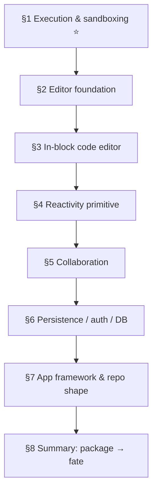
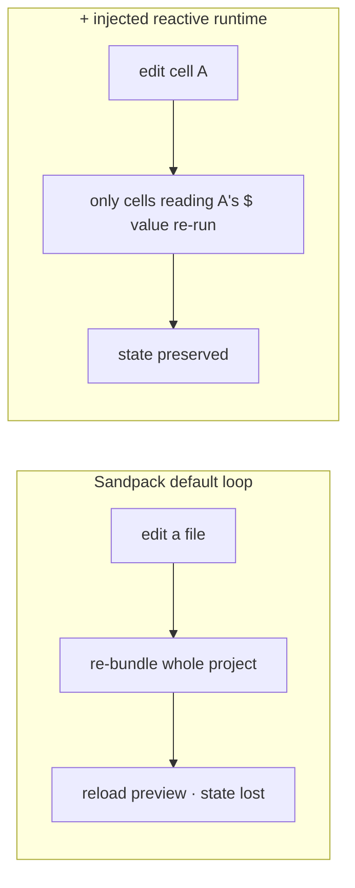
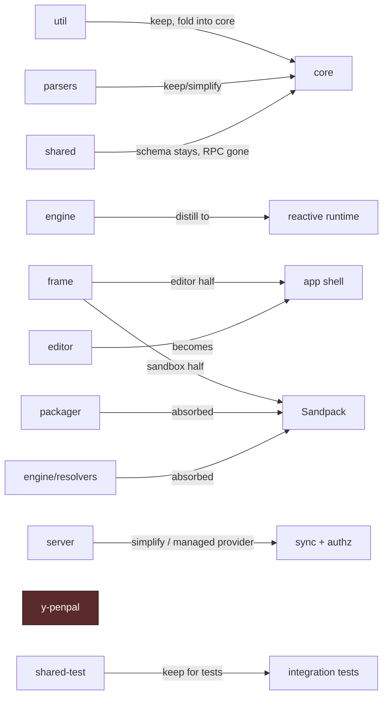

# Stack Decisions — Greenfield Alternatives to TypeCell's Stack

> **What this is.** An ADR-style (Architecture Decision Record) companion to the
> [greenfield-build-guide.md](./greenfield-build-guide.md). For each major concern it states the
> **current** TypeCell choice, the alternatives **considered**, the **decision**, and the **why**.
> The headline decision — replacing the bespoke execution/sandbox stack with **Sandpack** — is §1.

## Committed decisions

These are **decided**. The sections below give the reasoning and the alternatives considered.

| § | Concern | Decision |
|---|---|---|
| 1 | Execution & sandboxing | **Sandpack** (sandbox/bundle/npm/export) **+ a custom injected `$` runtime** for fine-grained reactive re-run |
| 2 | Editor foundation | **Tiptap-direct + [Tiptap UI Components](https://tiptap.dev/docs/ui-components/getting-started/overview)** — code cells as raw NodeViews |
| 3 | In-block code editor | **CodeMirror 6** inside the cell NodeView (Monaco an optional upgrade for IntelliSense) |
| 4 | Reactivity primitive | **Decided by an M3 spike** — MobX vs `@preact/signals-core` |
| 5 | Collaboration | **Managed Yjs provider** (Liveblocks / y-sweet / PartyKit) over `y-prosemirror` |
| 6 | Persistence / auth / DB | **Supabase** (auth + DB + cascading RLS permissions) |
| 7 | App framework & repo shape | **Vite + React SPA**; single app + `core` (+ `runtime`) lib |

> **App framework is now committed (Vite + React)** — but the architecture stays portable, because
> Tiptap, Yjs, and Sandpack are themselves framework-agnostic. The one place the host choice bites
> is the stateful-WebSocket realtime layer (§5, §7).

## How to read these

Each section: **The concern · Current choice · Considered · Decision · Why.** A decision is only
worth recording when the options genuinely differ in consequence — so the emphasis is uneven on
purpose (§1 carries most of the weight).

---

## 1. Execution & sandboxing (the big one) ⭐

**The concern.** Run untrusted user TS/React in the browser: isolate it, transpile it, resolve its
npm imports, render its output, and (eventually) export it as a real app.

**Current choice.** A hand-built stack spanning five packages:

- **Monaco** authoring + `SourceModelCompiler` (TS→JS, AMD output).
- **Sandboxed iframe** (`frame`) so user code can't touch auth tokens or crash the host
  ([frame-onboarding-guide.md](./frame-onboarding-guide.md)).
- **Penpal** typed RPC across the iframe boundary + **y-penpal** to sync a Y.Doc *replica* into the
  iframe ([y-penpal-onboarding-guide.md](./y-penpal-onboarding-guide.md)).
- **`engine/resolvers`** — runtime npm resolution via `es-module-shims` with an
  **ESM.sh → Skypack → JSPM** fallback chain ([engine-onboarding-guide.md](./engine-onboarding-guide.md)).
- **`packager`** — a separate, AWS Lambda-bound server-side pipeline for static export
  ([packager-onboarding-guide.md](./packager-onboarding-guide.md)).

**Greenfield option — Sandpack.** [Sandpack](https://sandpack.codesandbox.io/) is CodeSandbox's
in-browser bundler + (optional) editor + preview, packaged for embedding. The headless,
framework-agnostic `@codesandbox/sandpack-client` mounts a bundler iframe and exposes three
runtimes — **`SandpackRuntime`** (client-side bundler for JS frameworks), **`SandpackNode`**
(Nodebox, Node.js in-browser), and **`SandpackStatic`** — and resolves dependencies natively from
its own CDN. `@codesandbox/sandpack-react` wraps it as `<SandpackProvider>` + components.

**What Sandpack replaces:**

| Current piece | Replaced by Sandpack? |
|---|---|
| Sandboxed iframe (`frame`) | ✅ Sandpack *is* an isolated iframe bundler. |
| Penpal RPC + y-penpal replica sync | ✅ Gone — you hand files in; no Y.Doc lives inside the sandbox. |
| `engine/resolvers` (ESM.sh/Skypack/JSPM) | ✅ Native CDN npm resolution. |
| TS transpile plumbing | ✅ The bundler transpiles. |
| `packager` (Lambda static export) | ✅ The virtual project is already buildable/exportable. |
| Monaco (editor) | ⚠️ Optional — Sandpack ships a CodeMirror editor; keep Monaco only for IntelliSense (see §3). |

**What Sandpack does *not* replace — and this is the crux:**

> Sandpack bundles and runs a **project**. It has **no notion of independently-running cells that
> share a reactive `$` context and re-run when a dependency changes.** TypeCell's "spreadsheet for
> code" — the product's defining feature — is **not** something Sandpack provides. It must be built
> on top.

**The fine-grained-rerun vs whole-bundle-reload trade-off.**

**Decision.** Use **Sandpack for the sandbox, bundling, npm resolution, preview, and export** — and
build a **small reactive runtime on top** (injected as a virtual module; see
[greenfield-build-guide.md M3](./greenfield-build-guide.md#m3--many-cells--the-reactive--context--the-special-sauce)).
**Rejected:** leaning on Sandpack's whole-project re-bundle + reload as the execution model — it
loses the live, fine-grained reactivity that makes this a TypeCell-like product rather than an
embedded CodeSandbox.

**Why.** This keeps the one genuinely novel asset (the reactive engine *idea*) while deleting the
four packages that were pure incidental complexity of doing your own sandbox: `y-penpal`, the
iframe half of `frame`, the resolver subsystem of `engine`, and `packager`. You trade ~5 hand-built
subsystems for one maintained dependency, and you stop synchronizing a CRDT across a process
boundary.

---

## 2. Editor foundation

**The concern.** A Notion-style document with an **executable code-cell** and (later) collaborative
editing. The load-bearing detail: a code cell is not a static block — it hosts a live code editor
and must stay in sync with the document and Yjs.

**Current choice.** **BlockNote** (built on Tiptap/ProseMirror), which the project re-platformed
onto during Epoch 4 ([development-history.md](./development-history.md)).

**Considered.** The three realistic candidates are *all ProseMirror underneath* — the real axis is
**how much abstraction sits between you and ProseMirror**:

| Candidate | What it is | Abstraction | Code-cell fit |
|---|---|---|---|
| **Tiptap-direct** | Headless ProseMirror + the MIT [Tiptap UI Components](https://tiptap.dev/docs/ui-components/getting-started/overview) for Notion chrome | **Low** (max control) | A raw **NodeView** is the canonical ProseMirror pattern for an embedded code editor — best fit. |
| **Novel** | A Tiptap *preset*: Notion-style extensions + AI autocomplete ([repo](https://github.com/steven-tey/novel)) | Low (it's just Tiptap extensions) | Same as Tiptap-direct; add the cell as another extension. Fast Notion-style start; React/Next-leaning. |
| **BlockNote** | A *block model* + JSON schema on top of Tiptap | **High** | You fit the executable cell into BlockNote's block API — the abstraction most likely to fight an embedded, independently-managed code editor. |

> **Maintenance note (correcting a common assumption):** Novel is **not** abandoned — it shipped
> **1.0.0 on 2026-02-11** and added a co-maintainer. It just removed its markdown extension from
> defaults in 1.0, so you opt back into Markdown explicitly. ([releases](https://github.com/steven-tey/novel/releases))

**Decision.** **Tiptap-direct**, bootstrapped from **Tiptap UI Components / the Simple Editor
template** for the Notion chrome. The code cell is a **custom Tiptap Node + NodeView** carrying
`id` / `language` / `code`; in M4 that NodeView hosts CodeMirror (§3). **Novel** is the sanctioned
faster-start alternative (eject to raw Tiptap when the cell node needs control). **BlockNote** is
*considered and not chosen.*

**Why.** The hardest part of the whole Document layer is the **code-cell ↔ embedded editor ↔ Yjs**
seam — the same Monaco↔ProseMirror pain [frame-onboarding-guide.md](./frame-onboarding-guide.md)
flags in the current code, which BlockNote did **not** make easy there either. A raw NodeView gives
the most control over exactly that seam. Secondary wins: Tiptap is the **most framework-portable**
of the three (keeps §7 open), and persists ProseMirror/Yjs state your cell model maps onto directly.
The one thing BlockNote does better — turnkey collaboration — is a well-trodden add-on in Tiptap
(`@tiptap/extension-collaboration` over `y-prosemirror`), so it doesn't outweigh the cell-seam
control.

**M1 implementation note (added when M1 shipped).** Built on **Tiptap v3** (`@tiptap/*` 3.x) — React
stays 18 (Tiptap v3's React peer dep is `^17 || ^18 || ^19`, so the React-18 constraint holds). Prose
↔ markdown uses the **official `@tiptap/markdown`** extension (shipped in Tiptap 3.7; its
`editor.storage.markdown.manager` exposes `parse()` / `serialize()`), **not** the third-party
`tiptap-markdown`, which the author has put in maintenance mode and now redirects to the official one.
The `core` `NotebookDocument` stays the persisted contract: a code-cell NodeView ↔ a `typescript`/`css`
cell, and each run of prose between cells ↔ one `markdown` cell serialized via that manager.

---

## 3. In-block code editor

**The concern.** The editor *inside* a code cell.

**Current choice.** **Monaco** (VS Code's editor) with TypeScript IntelliSense and `.d.ts` type
resolution for imported packages — the source of the tricky Monaco↔ProseMirror↔Yjs sync in `frame`.

**Considered.** CodeMirror 6 (lightweight; what Sandpack uses) · Sandpack's built-in `CodeEditor` ·
Monaco.

**Decision.** **CodeMirror 6**, mounted inside the cell's Tiptap NodeView (§2). **Monaco** is an
*optional later upgrade* — add it only when authoring ergonomics (full IntelliSense, type hovers
for npm imports) justify the weight (the M4 optional sub-step).

**Why.** Monaco is large and its bidirectional sync with ProseMirror is one of the current
codebase's most fragile seams; CodeMirror is lighter and embeds cleanly in a NodeView. You get
syntax + editing cheaply and can upgrade the authoring experience later without blocking execution.

---

## 4. Reactivity primitive

**The concern.** The mechanism behind the `$` context that tracks reads and re-runs dependent cells.

**Current choice.** **MobX** `autorun()` over an observable `$` object wrapped in a Proxy
([engine-onboarding-guide.md](./engine-onboarding-guide.md) §3.3–3.4).

**Considered.** MobX · signals (`@preact/signals-core`, Solid-style, `Reactively`).

**Decision.** **Decide with a short M3 spike**, not up front — the `$`-context pattern is
library-agnostic, so this is an ergonomic/footprint call best made against a working prototype.
Prototype the injected runtime against **MobX** *and* **`@preact/signals-core`** and score them on:

1. **Bundle size** added to the runtime (it ships inside *every* Sandpack project).
2. **Tracking ergonomics** — how naturally a cell's reads/writes of `$` become dependencies.
3. **Side-effect teardown** — clean disposal of timers/listeners on re-run (today's
   `hookDisposables.ts` concern in [engine-onboarding-guide.md](./engine-onboarding-guide.md)).

**Why deferred (not just indecision).** MobX's automatic deep read-tracking is the highest-fidelity
port of the current engine; signals give the same dependency-graph semantics with a smaller, more
explicit footprint. Which wins depends on the three measurements above, which only a spike answers —
and the decision is reversible behind the runtime's `$`/`autorun` interface, so it shouldn't block
M0–M2.

---

## 5. Collaboration

**The concern.** Real-time multi-user editing and presence over the Yjs CRDT.

**Current choice.** **Self-hosted HocusPocus** WebSocket server + a custom Supabase persistence
extension ([server-onboarding-guide.md](./server-onboarding-guide.md)).

**Considered.**

- **Managed Yjs providers:** Liveblocks · y-sweet (Jamsocket) · PartyKit (Cloudflare).
- **Self-hosted:** HocusPocus.
- **Non-Yjs realtime:** Convex · Replicache (different data model; you'd give up the editor's native
  `y-prosemirror` collaboration).

**Decision.** A **managed Yjs provider** (Liveblocks / y-sweet / PartyKit). Self-hosted HocusPocus
is the higher-ops fallback if cost/control demands it. **Rejected:** non-Yjs realtime (Convex /
Replicache) — see §6; it would discard Tiptap's native collaboration.

**Why.** Real-time sync needs a **stateful, long-lived WebSocket host** — awkward on classic
serverless (a specific caveat on Vercel: use Fluid Compute or a managed provider, not a standard
short-lived function). A managed provider removes an entire ops surface at the stage where you
should be proving the product, not running infrastructure. And because the editor (§2) already
speaks Yjs via `y-prosemirror`, a Yjs provider is nearly free to wire in.

---

## 6. Persistence / auth / DB

**The concern.** Store documents, authenticate users, enforce per-document permissions.

**Current choice.** **Supabase** (Postgres + Auth), with **all authorization in Postgres RLS** —
including a recursive `check_document_access()` that cascades workspace grants to child documents.

**Considered.** Supabase · Clerk (auth) + Neon (Postgres) · Convex (DB + auth + realtime in one).

**Decision.** **Supabase** (auth + Postgres + cascading RLS). **Rejected: Convex** — although it
would unify persistence + realtime + auth and could drop the §5 provider, it is **non-Yjs**, so
adopting it means giving up Tiptap's native `y-prosemirror` collaboration and re-solving merge/cursor
behavior yourself. Keeping Yjs (§2, §5) makes that trade not worth it. Clerk+Neon stays a viable
swap if you outgrow Supabase auth.

**Why.** The valuable *property* is DB-enforced, **cascading** permissions — parent-document grants
inherited by children, so one share covers a workspace (today's recursive `check_document_access()`).
Supabase RLS expresses that directly with the least rethinking; replicate the property whatever you
pick.

---

## 7. App framework & repo shape

**The concern.** What hosts the app, and how many packages the repo has.

**Current choice.** A **Vite SPA** (`editor`) hosting a second Vite app in an iframe (`frame`),
inside a **10-package npm-workspaces monorepo**.

**Considered.** Vite SPA + light backend · Next.js (App Router) on Vercel · stay framework-agnostic.
Repo: single app + 1–2 libs vs the existing 10 packages.

**Decision.** **Vite + React SPA.** Repo shape collapses hard: a **single application plus a small
`core` lib** (cell model + utils) and an optional **`runtime` lib** (the injected reactive context).
The architecture stays portable (Tiptap/Yjs/Sandpack are framework-agnostic), so a later move to
Next.js/Remix changes only the shell — but committing to one stack keeps every milestone runnable.
One platform caveat regardless of host: the realtime layer (§5) needs a stateful WebSocket host —
on Vercel that means Fluid Compute or a managed provider, not a vanilla serverless function.

**Why.** Most of the current package count exists to serve the **iframe-as-separate-app** boundary
(see [greenfield-build-guide.md](./greenfield-build-guide.md), "Why the existing rebuild plan
isn't the greenfield plan"). Remove that boundary (Sandpack, §1) and there is no second app to
host and no cross-process contract to package — so the 10 packages collapse toward 1 app + 1–2 libs.

---

## 8. Summary — current package → greenfield fate

| Current package | Fate | Rationale |
|---|---|---|
| `util` | **Keep** | Generic helpers → small `core` lib. |
| `shared` | **Mostly dissolves** | Host↔iframe RPC contract gone with the iframe split; DB `schema` types stay. |
| `y-penpal` | **Drop** | No iframe-app boundary to transport a Y.Doc across. |
| `engine` | **Rebuild as injected runtime** | Keep the `$`/autorun idea; drop AMD patching + CDN resolvers. |
| `parsers` | **Keep/simplify** | Cell model + markdown ⟷ notebook conversion. |
| `frame` | **Split** | Editor half → app shell; sandbox half → Sandpack. |
| `server` | **Simplify / replace** | Managed Yjs provider; preserve cascading DB permissions. |
| `editor` | **Becomes the app shell** | No iframe to host. |
| `packager` | **Absorbed by Sandpack** | Export is near-free from the virtual project. |
| `shared-test` | **Keep as needed** | Integration tests against the real stack. |

---

## Sources

- [Sandpack — Component toolkit](https://sandpack.codesandbox.io/)
- [Sandpack Client (advanced usage)](https://sandpack.codesandbox.io/docs/advanced-usage/client)
- [Sandpack bundler (repo)](https://github.com/codesandbox/sandpack-bundler)
- [@codesandbox/sandpack-client — npm](https://www.npmjs.com/package/@codesandbox/sandpack-client)
- [Tiptap UI Components](https://tiptap.dev/docs/ui-components/getting-started/overview) · [Simple Editor template](https://tiptap.dev/docs/ui-components/templates/simple-editor)
- [Novel — repo](https://github.com/steven-tey/novel) · [releases (1.0.0, 2026-02-11)](https://github.com/steven-tey/novel/releases)

For the current implementation each decision diverges from, see the per-package onboarding guides
in this directory ([README](./README.md)).
